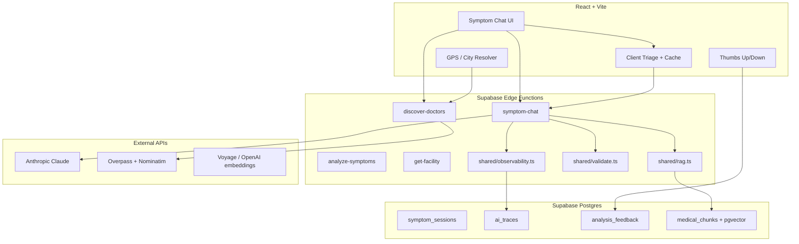

# HealthPilot AI — Complete CV Implementation Plan

A phased plan to evolve your **existing** codebase into a portfolio-grade project for **AI Engineer | LLMOps | Generative AI | NLP | AI Systems Builder**. Assumes **~2–4 weeks** part-time; adjust scope if you have less time.

---

## 0. Goals and success criteria

| Goal | Done when |
|------|-----------|
| **Recruiter can understand in 60s** | Public README + architecture diagram + live demo URL |
| **LLMOps credibility** | `eval/` dataset + script + `docs/eval-results.md` with metrics |
| **Generative AI depth** | RAG injected into `symptom-chat` final analysis |
| **Safety story** | Zod validation + feedback UI + `ai_interactions` audit table |
| **Systems story** | CI, unit tests on triage/ranking, optional tracing |
| **NLP differentiation** | EN/Ur eval split + language detection (Roman Urdu) |

**Out of scope for v1 CV sprint:** full appointment marketplace, payment gateways, native mobile app.

---

## 1. Current baseline (what you already ship)

```
healthpilot-ai/
├── src/
│   ├── components/symptoms/     # SymptomChatInterface, AnalysisResultPanel, …
│   ├── services/
│   │   ├── symptomChatService.ts
│   │   ├── liveCareDiscoveryService.ts
│   │   └── doctorService.ts     # legacy appointments only
│   ├── utils/symptomTriage.ts   # client emergency rules + pattern cache
│   └── hooks/useCareLocation.ts # GPS-first facility search
└── supabase/functions/
    ├── symptom-chat/            # multi-turn + tools
    ├── analyze-symptoms/        # single-shot analysis
    ├── discover-doctors/        # OSM pipeline
    └── get-facility/
```

**Do not rebuild these.** Extend them.

---

## 2. Target architecture (end state)



---

## 3. Repository layout (new files to add)

```
healthpilot-ai/
├── README.md                          # NEW — portfolio entry point
├── docs/
│   ├── architecture.md                # NEW
│   ├── api-contracts.md               # NEW — edge function I/O
│   ├── eval-results.md                # NEW — metrics table (updated by CI)
│   └── safety.md                      # NEW — disclaimers + guardrails
├── eval/
│   ├── cases.jsonl                    # NEW — gold dataset
│   ├── cases-ur.jsonl                 # NEW — Urdu subset (20+)
│   ├── schema.ts                      # NEW — case + expected output types
│   └── run-eval.ts                    # NEW — Deno/Node eval runner
├── scripts/
│   └── seed-corpus.ts                 # NEW — embed + insert RAG chunks
├── supabase/
│   ├── functions/
│   │   ├── _shared/
│   │   │   ├── models.ts              # NEW — MODELS list (single source)
│   │   │   ├── schemas.ts             # NEW — Zod analysis schema
│   │   │   ├── rag.ts                 # NEW — retrieve + format context
│   │   │   ├── observability.ts       # NEW — trace logging
│   │   │   └── safety.ts              # NEW — post-check rules
│   │   └── symptom-chat/index.ts    # MODIFY — use shared modules
│   └── migrations/
│       └── 007_llmops_rag.sql         # NEW — traces, feedback, pgvector
├── src/
│   ├── schemas/symptomAnalysis.ts     # NEW — mirror edge Zod (client)
│   ├── components/symptoms/
│   │   └── AnalysisFeedback.tsx       # NEW — thumbs + optional comment
│   └── lib/languageDetect.ts          # NEW — en / ur / roman-ur
├── .github/workflows/ci.yml           # NEW
└── corpus/
    └── pakistan-guidelines/           # NEW — markdown sources for RAG
        ├── red-flags.md
        ├── specialty-routing.md
        └── common-conditions-pk.md
```

---

## 4. Implementation phases

### Phase A — Portfolio shell (Days 1–3)

**CV impact:** AI Systems Builder, immediate GitHub quality

| Task | Details | Files |
|------|---------|--------|
| A1. README | Problem, solution, stack, setup, env vars, deploy commands, **demo link**, screenshot/GIF | `README.md` |
| A2. Architecture doc | Mermaid (above), data flow, why tools vs JSON, why OSM vs DB | `docs/architecture.md` |
| A3. API contracts | Request/response for each edge function + error codes | `docs/api-contracts.md` |
| A4. Deploy frontend | Vercel/Netlify + env `VITE_SUPABASE_*` | `vercel.json` optional |
| A5. Demo script | 3-min Loom: symptom → analysis → Lahore facilities | (external) |

**Acceptance:** Someone clones repo, follows README, runs `npm run dev` in <10 min.

---

### Phase B — LLMOps foundation (Days 4–8)

**CV impact:** LLMOps, AI Engineer

#### B1. Gold evaluation dataset

Create **`eval/cases.jsonl`** — one JSON object per line (~40 cases):

```json
{
  "id": "chest-pain-emergency-en",
  "language": "en",
  "symptoms": "severe chest pain radiating to left arm, sweating",
  "user_age": 55,
  "user_gender": "male",
  "expected": {
    "severity_level": "emergency",
    "recommended_specialty_slug": "cardiology",
    "must_include_red_flag": true
  }
}
```

**Coverage matrix (minimum):**

| Dimension | Count |
|-----------|-------|
| `emergency` severity | 8 |
| `severe` / `moderate` / `mild` | 8 each |
| Specialty slugs (cardiology, derm, ent, …) | 3+ each top 5 |
| Urdu script | 10 |
| Roman Urdu | 10 |
| Pediatric / pregnancy hints | 4 |

Duplicate structure in **`eval/cases-ur.jsonl`** or single file with `language` field.

#### B2. Eval runner

**`eval/run-eval.ts`** (Deno recommended — matches edge runtime):

1. Load `cases.jsonl`.
2. For each case, call `analyze-symptoms` (faster than full chat) OR `symptom-chat` with `forceFinalize: true`.
3. Score:
   - **severity_exact** — match `expected.severity_level`
   - **specialty_exact** — match `recommended_specialty_slug`
   - **emergency_recall** — TP/(TP+FN) for emergency cases
   - **json_valid** — response passes Zod (Phase C)
   - **latency_ms** — p50, p95
4. Write **`docs/eval-results.md`** (auto-generated header + table).

**`package.json` scripts:**

```json
"eval": "deno run -A eval/run-eval.ts",
"eval:report": "deno run -A eval/run-eval.ts --write-report"
```

**Env:** `SUPABASE_URL`, `SUPABASE_ANON_KEY`, optional `EVAL_SAMPLE_SIZE=10` for CI.

#### B3. Shared model config

Extract from both edge functions:

```typescript
// supabase/functions/_shared/models.ts
export const MODELS = [
  'claude-sonnet-4-6',
  'claude-sonnet-4-5-20250929',
  'claude-haiku-4-5-20251001',
] as const
```

Import in `symptom-chat` and `analyze-symptoms` (Supabase bundles `_shared` when imported relatively).

#### B4. Observability (lightweight — no Langfuse required for v1)

**Migration `007_llmops_rag.sql`:**

```sql
CREATE TABLE ai_traces (
  id UUID PRIMARY KEY DEFAULT gen_random_uuid(),
  trace_id TEXT NOT NULL,
  function_name TEXT NOT NULL,
  model TEXT,
  input_tokens INT,
  output_tokens INT,
  latency_ms INT,
  status TEXT CHECK (status IN ('ok', 'error', 'validation_failed')),
  error_message TEXT,
  user_id UUID REFERENCES profiles(id),
  session_id UUID REFERENCES symptom_sessions(id),
  created_at TIMESTAMPTZ DEFAULT NOW()
);

CREATE INDEX ai_traces_trace_id ON ai_traces(trace_id);
CREATE INDEX ai_traces_created_at ON ai_traces(created_at DESC);
```

**`supabase/functions/_shared/observability.ts`:**

- Generate `trace_id = crypto.randomUUID()`.
- After each Claude call: insert row (no raw symptom text if you want privacy — store hashes or lengths only).
- Return `trace_id` in API response for feedback linkage.

**Acceptance:** Run eval on 40 cases; `docs/eval-results.md` shows ≥85% specialty accuracy and ≥95% emergency recall (tune prompts until close).

---

### Phase C — Safety and schema validation (Days 9–11)

**CV impact:** AI Engineer, responsible AI

#### C1. Zod schema (shared contract)

**`supabase/functions/_shared/schemas.ts`:**

```typescript
import { z } from 'npm:zod'

export const SymptomAnalysisSchema = z.object({
  primary_condition: z.string().optional(),
  condition_confidence: z.enum(['high', 'medium', 'low']).optional(),
  brief_summary: z.string(),
  possible_conditions: z.array(z.string()).max(5),
  recommended_specialty: z.string(),
  recommended_specialty_slug: z.enum([/* your slugs */]),
  severity_level: z.enum(['mild', 'moderate', 'severe', 'emergency']),
  explanation: z.string().max(2000),
  first_aid_tips: z.array(z.string()).max(5),
  red_flags: z.array(z.string()).max(5),
  disclaimer: z.string(),
  urdu_summary: z.string(),
})
```

#### C2. Validation + retry in `symptom-chat`

After tool output:

1. `SymptomAnalysisSchema.safeParse(toolInput)`
2. If fail → retry **once** same model with “fix JSON to match schema”
3. If still fail → try next model in `MODELS`
4. Log `validation_failed` to `ai_traces`

#### C3. Safety post-rules (`_shared/safety.ts`)

| Rule | Action |
|------|--------|
| `severity_level === 'emergency'` | Ensure `red_flags` non-empty; append 1122/Edhi if missing |
| Chest pain + severe keywords in input | Floor severity to at least `severe` |
| Output contains “you have X disease” | Replace tone via regex or re-prompt (block definitive diagnosis phrases) |
| `recommended_specialty_slug` invalid | Map to `general` |

Mirror lightweight checks on **`src/utils/symptomTriage.ts`** for client-side consistency.

#### C4. Human feedback

**Table:**

```sql
CREATE TABLE analysis_feedback (
  id UUID PRIMARY KEY DEFAULT gen_random_uuid(),
  session_id UUID REFERENCES symptom_sessions(id),
  trace_id TEXT,
  rating SMALLINT CHECK (rating IN (-1, 1)),
  comment TEXT,
  created_at TIMESTAMPTZ DEFAULT NOW()
);
```

**UI:** `AnalysisFeedback.tsx` below `AnalysisResultPanel` — thumbs + optional 200-char comment → `supabase.from('analysis_feedback').insert(...)`.

**Acceptance:** Invalid tool payloads never reach UI; emergency cases always show red-flag card.

---

### Phase D — RAG layer (Days 12–16)

**CV impact:** Generative AI, NLP

#### D1. Corpus (start small — 15–30 chunks)

**`corpus/pakistan-guidelines/`** — hand-written or summarized (no copyrighted MOH PDF paste):

- `red-flags.md` — chest pain, stroke, dengue hemorrhagic, pregnancy bleeding
- `specialty-routing.md` — symptom → specialty_slug mapping table
- `common-conditions-pk.md` — dengue, typhoid, hepatitis, heatstroke (seasonal)

Chunk size: **300–500 tokens**, overlap 50 tokens.

#### D2. Database

**In `007_llmops_rag.sql`:**

```sql
CREATE EXTENSION IF NOT EXISTS vector;

CREATE TABLE medical_chunks (
  id UUID PRIMARY KEY DEFAULT gen_random_uuid(),
  slug TEXT UNIQUE,
  title TEXT,
  content TEXT NOT NULL,
  specialty_tags TEXT[],
  embedding vector(1024),  -- match embedding model dims
  created_at TIMESTAMPTZ DEFAULT NOW()
);

CREATE INDEX medical_chunks_embedding_idx
  ON medical_chunks USING ivfflat (embedding vector_cosine_ops)
  WITH (lists = 20);
```

**Embedding choice:**

| Option | Pros |
|--------|------|
| **Voyage AI** (`voyage-3`) | Strong for retrieval; Anthropic ecosystem |
| **OpenAI** `text-embedding-3-small` | Cheap, well documented |
| **Supabase gte-small** | If you want zero extra vendor |

#### D3. Ingest script

**`scripts/seed-corpus.ts`:**

1. Read markdown files → chunks.
2. Embed each chunk.
3. Upsert into `medical_chunks`.

Run once locally: `deno run -A scripts/seed-corpus.ts`.

#### D4. Retrieval in edge

**`supabase/functions/_shared/rag.ts`:**

```typescript
export async function retrieveContext(
  supabase: SupabaseClient,
  query: string,
  specialtyHint?: string,
  k = 4
): Promise<string> {
  // 1. embed query
  // 2. rpc match_medical_chunks(query_embedding, match_count)
  // 3. return formatted bullet list for system prompt
}
```

**SQL RPC:**

```sql
CREATE FUNCTION match_medical_chunks(
  query_embedding vector(1024),
  match_count int DEFAULT 4
) RETURNS TABLE (slug text, title text, content text, similarity float)
...
```

#### D5. Wire into `symptom-chat`

Only on **finalize** turn (not follow-ups — saves tokens):

```typescript
const ragContext = await retrieveContext(supabase, lastUserMessage, specialtyHint)
const ANALYSIS_SYSTEM_WITH_RAG = `${ANALYSIS_SYSTEM}\n\n## Reference guidelines\n${ragContext}`
```

**Eval impact:** Re-run `eval/run-eval.ts`; compare specialty accuracy before/after → document in `docs/eval-results.md` § RAG ablation.

**Acceptance:** Analysis for “dengue fever 3 days rash” cites plausible local guidance; eval specialty accuracy improves or holds.

---

### Phase E — NLP depth (Days 17–19)

**CV impact:** NLP

| Task | Implementation |
|------|----------------|
| E1. Language detect | `src/lib/languageDetect.ts` — Unicode Arabic range → `ur`; common Roman Urdu tokens (`hai`, `dard`, `bukhar`) → `roman-ur`; else `en` |
| E2. Pass `detected_language` to edge | Extend `symptom-chat` body; adjust system prompt |
| E3. Urdu eval split | `eval/run-eval.ts --lang=ur` reports separate metrics |
| E4. Optional ASR | **Week 4+ only:** Whisper via small edge `transcribe-symptom` or browser Web Speech API prototype |

**Acceptance:** `docs/eval-results.md` has EN vs UR table; UI auto-sets chat language.

---

### Phase F — Production engineering (Days 20–22)

**CV impact:** AI Systems Builder

#### F1. Unit tests (Vitest)

```bash
npm i -D vitest @vitest/coverage-v8
```

| Test file | Targets |
|-----------|---------|
| `src/utils/symptomTriage.test.ts` | emergency keywords, cache hits |
| `src/utils/doctorRanking.test.ts` | ranking order, dedupe |
| `src/utils/locationUtils.test.ts` | `nearestCitySlug`, `resolveCareLocation` |
| `src/schemas/symptomAnalysis.test.ts` | Zod parse fixtures |

**`package.json`:** `"test": "vitest run"`

#### F2. CI (GitHub Actions)

**`.github/workflows/ci.yml`:**

```yaml
on: [push, pull_request]
jobs:
  build:
    runs-on: ubuntu-latest
    steps:
      - uses: actions/checkout@v4
      - uses: actions/setup-node@v4
      - run: npm ci
      - run: npm run lint
      - run: npm run build
      - run: npm test
  eval-smoke:  # optional nightly or manual
    if: github.event_name == 'schedule'
    steps:
      - run: npm run eval -- --sample 5
    env:
      SUPABASE_URL: ${{ secrets.SUPABASE_URL }}
      SUPABASE_ANON_KEY: ${{ secrets.SUPABASE_ANON_KEY }}
```

#### F3. Rate limiting (edge)

Simple in-memory or Supabase table `rate_limits(user_id, window_start, count)` — max **20 symptom-chat calls / hour / user**. Return 429 with clear message.

#### F4. Cost control

- Cache finalized analysis by hash of symptoms (`symptom_sessions` or Redis-like table) — you already have client pattern cache; extend server-side for identical prompts.
- Log `input_tokens` / `output_tokens` in `ai_traces` from Claude `usage` block.

---

### Phase G — Optional multimodal (Days 23–28, pick ONE)

**CV impact:** Computer Vision (only if you demo it well)

| Option | Flow | New pieces |
|--------|------|------------|
| **G1. Skin rash triage** | Upload image → edge `analyze-image` → Claude vision → `dermatology` + disclaimer | `src/components/symptoms/ImageUpload.tsx`, `supabase/functions/analyze-image/` |
| **G2. Prescription OCR** | Photo → vision extract clinic name → `discover-doctors` with `hospital` filter | Same edge, different prompt |

**Guardrails:** Never return diagnosis; only “consider seeing a dermatologist” + ER if bleeding/infection signs.

---

## 5. Two-week sprint schedule (recommended)

| Day | Phase | Deliverable |
|-----|-------|-------------|
| 1–2 | A | README + architecture + deployed demo |
| 3–5 | B | `eval/cases.jsonl` + `run-eval.ts` + first metrics doc |
| 6–7 | B | `ai_traces` + shared `models.ts` |
| 8–9 | C | Zod validation + safety rules + feedback UI |
| 10–12 | D | corpus + pgvector + RAG in finalize |
| 13 | D | Re-run eval, document RAG lift |
| 14 | E | language detect + Urdu eval split |
| 15–16 | F | Vitest + CI |
| 17–18 | F | rate limit + token logging |
| 19–21 | G (optional) | one vision feature + README section |
| 22 | — | Record Loom, polish CV bullets, pin GitHub repo |

**If only 1 week:** Do **A + B + C** only (README, eval, validation, feedback). Skip RAG and vision until week 2.

---

## 6. What you already have (use this on your CV)

Don't undersell the current stack. You can honestly claim:

| Area | What you built |
|------|----------------|
| **Generative AI** | Multi-turn `symptom-chat` with tools (`ask_follow_up`, `submit_symptom_analysis`), model fallback |
| **NLP** | English + Urdu UX, structured medical output, client-side emergency triage |
| **AI systems** | Edge functions as AI gateway, discovery pipeline (Overpass + Nominatim), ranking/dedup |
| **Product AI** | Symptom → specialty → geo-ranked facilities (end-to-end agentic flow) |

**CV one-liner example:**

*“Built a bilingual healthcare navigation system using Claude tool-calling, structured JSON outputs, and a live geospatial facility pipeline (OpenStreetMap) on Supabase Edge Functions.”*

---

## 7. CV copy-paste block (after Phase B–D)

**HealthPilot AI** — AI Healthcare Navigation (Pakistan)

- End-to-end **agentic symptom flow**: client triage → multi-turn **Claude tool-calling** → schema-validated analysis → **GPS-ranked** OpenStreetMap facilities.
- **LLMOps:** 40-case eval harness (specialty accuracy, emergency recall, latency p95); `ai_traces` observability; thumbs feedback loop.
- **RAG:** pgvector retrieval over Pakistan-focused clinical guidelines injected at analysis time.
- **4 Supabase Edge Functions** with model fallback chain; bilingual EN/Urdu/Roman Urdu.
- **Stack:** TypeScript, React, Anthropic API, Supabase, Leaflet, Deno.
- Links: [GitHub] · [Live Demo] · [Architecture] · [Eval Results]

---

## 8. Risk and scope control

| Risk | Mitigation |
|------|------------|
| Eval costs API $ | `--sample 10` locally; full 40 only before releases |
| RAG hallucination | Keep corpus small + cite “reference guidelines” in UI |
| Medical liability | Prominent disclaimer; never “diagnosis”; document in `docs/safety.md` |
| Supabase `_shared` import issues | Test deploy early; inline duplicate if bundler fails |
| Scope creep | No JazzCash, no full doctor CRM in CV sprint |

---

## 9. Definition of done (portfolio-ready)

- [ ] Public repo with README + demo URL
- [ ] `docs/architecture.md` + `docs/eval-results.md` with real numbers
- [ ] `npm test` + CI green
- [ ] Eval: ≥85% specialty exact, ≥95% emergency recall (tune until close)
- [ ] RAG enabled on finalize path
- [ ] Feedback + traces tables populated in staging
- [ ] 2–3 min demo video
- [ ] CV bullets match **implemented** features only

---

## 10. What to implement first (recommended coding order)

1. **Phase A** — `README.md` + `docs/architecture.md`
2. **Phase B** — `eval/` + `007_llmops_rag.sql` (traces only) + `run-eval.ts`
3. **Phase C** — `_shared/schemas.ts` + validation + `AnalysisFeedback.tsx`
4. **Phase D** — corpus + RAG
5. **Phase F** — Vitest + CI

---

## 11. GitHub polish checklist

- [ ] Public repo with clear README (problem → solution → stack → demo GIF)
- [ ] `docs/eval-results.md` with a small metrics table
- [ ] Pin repo on profile; add topics: `llm`, `healthcare-ai`, `rag`, `supabase`, `claude`
- [ ] Remove secrets; keep `.env.example` updated

---

**Bottom line:** You already have a credible **generative AI + systems** story. To match **LLMOps** and stand out, add **evals + observability + RAG + README/demo**. Add **vision or voice** only if you want those keywords and can demo one feature well.
