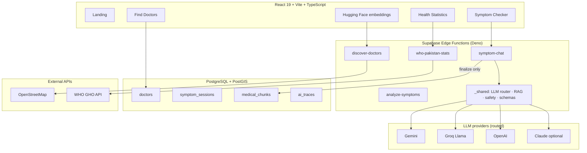

# HealthPilot AI

**Bilingual healthcare navigation for Pakistan** — AI symptom guidance, a **7,000+** doctor directory, live hospitals from **OpenStreetMap**, and **WHO** public health statistics. Built as a production-style full-stack application with a multi-provider **Generative AI / LLMOps** stack.

[](https://health-pilot-ai-three.vercel.app/)
[](https://www.typescriptlang.org/)
[](https://react.dev/)
[](https://supabase.com/)
[](./vitest.config.ts)

| | |
|---|---|
| **Live app** | [health-pilot-ai-three.vercel.app](https://health-pilot-ai-three.vercel.app/) |
| **Repository** | [github.com/Faran-samra/HealthPilot-AI](https://github.com/Faran-samra/HealthPilot-AI) |
| **Stack** | React 19 · Vite · TypeScript · Supabase · PostGIS · Multi-LLM · RAG · OSM · WHO GHO |

> **Medical disclaimer:** HealthPilot AI provides **informational guidance only** — not a medical diagnosis or prescription. Always consult a qualified clinician in Pakistan. In an emergency, call **Rescue 1122** or **Edhi 115**.

---

## Table of contents

- [Overview](#overview)
- [What you can do](#what-you-can-do)
- [Key features](#key-features)
- [System architecture](#system-architecture)
- [AI symptom checker (deep dive)](#ai-symptom-checker-deep-dive)
- [RAG medical knowledge base](#rag-medical-knowledge-base)
- [Doctor directory](#doctor-directory)
- [Healthcare facilities map](#healthcare-facilities-map)
- [WHO Pakistan statistics](#who-pakistan-statistics)
- [Tech stack](#tech-stack)
- [Project structure](#project-structure)
- [Getting started](#getting-started)
- [Environment & secrets](#environment--secrets)
- [Deployment](#deployment)
- [Scripts reference](#scripts-reference)
- [Testing & CI](#testing--ci)
- [Security & compliance](#security--compliance)
- [Documentation](#documentation)
- [License](#license)

---

## Overview

Pakistan’s healthcare system is large but fragmented. Patients often do not know **which specialist to see**, struggle to compare **doctors by city, fee, and hospital**, and lack one place for **trustworthy national health context**.

**HealthPilot AI** brings that together in a single free web app (English + Urdu):

1. **Describe symptoms** in a private AI conversation.
2. Receive **urgency level**, **specialty guidance**, **first-aid tips**, **red flags**, and **possible concerns** — guidance only, not a diagnosis.
3. **Find real doctors** from a nationwide directory with fees, hospitals, and practice timings.
4. **See nearby hospitals and clinics** on a live map (OpenStreetMap).
5. Explore **WHO Pakistan health statistics** in plain language.

The product is **guest-first**: the symptom checker and doctor search work without signup. Optional auth unlocks the dashboard, symptom history, and appointments.

---

## What you can do

| Feature | Route | Description |
|---------|-------|-------------|
| **Symptom checker** | `/symptom-checker` | Multi-turn AI chat → structured analysis → nearby doctors |
| **Find doctors** | `/doctors` | 7,000+ profiles — city, specialty, fee, gender, Near Me |
| **Healthcare facilities** | `/healthcare-facilities` | Live hospitals/clinics from OpenStreetMap |
| **Health statistics** | `/health-statistics` | WHO GHO data for Pakistan |
| **Health awareness** | `/health-info` | Guides on dengue, diabetes, hypertension, etc. |
| **Landing** | `/` | Product overview, how it works, example journeys |
| **Book appointment** | `/doctors/:id/book` | Guest booking with Marham integration |
| **Dashboard** | `/dashboard` | History and appointments (signed-in users) |

---

## Key features

### Bilingual by design

- Full UI in **English** and **Urdu** (`react-i18next`).
- Symptom chat detects language from **what the user writes**, not only the UI setting — English input gets English follow-ups; Roman Urdu gets Roman Urdu.
- Pakistani Roman Urdu quality rules (avoid Hindi-style wording in patient-facing text).

### Intelligent symptom routing

- **Intent classification** for common patterns: allergic rhinitis, palpitations/stress, fever, seizures, jaundice, emergencies, and more (`symptom-intent.ts`).
- **Specialty mapping** post-processing ensures results match the condition (e.g. ENT for hay fever, cardiology for palpitations — not neurology or psychiatry by mistake).
- **Doctor search** ranks the correct specialty and excludes false matches (e.g. dentists when ENT is recommended).

### Resilient AI pipeline

- **Multi-provider LLM router**: Gemini → Groq (Llama) → OpenAI → optional Claude for high-risk cases.
- **Tool calling** (`ask_follow_up`, `submit_symptom_analysis`) with Zod validation — no fragile raw JSON parsing.
- **Guided fallbacks** when all LLM providers fail (allergy, palpitations, anaphylaxis, seizures, etc.).
- **Groq rate-limit handling**: skips redundant JSON fallback requests; fails over to the next provider.
- **Client-side emergency triage** in &lt;1 ms before any network call.

### RAG-grounded analysis

- NHS UK conditions localized for **Pakistan** (Rescue 1122, Edhi, hospital context).
- Vector search over `medical_chunks` (pgvector) — runs **only on final analysis**, never during triage follow-ups.
- Slug-based fallback retrieval when embeddings are unavailable.
- Medical references shown in the results panel with clean citations.

### Real doctor data

- **7,000+** published profiles ingested from **Marham.pk** through a staging → review → publish pipeline.
- PostGIS distance search, Near Me (GPS), specialty fuzzy matching, fee and gender filters.
- PMDC numbers and verification badges where available.

---

## System architecture



### Symptom → doctor journey

1. User describes symptoms (English or Urdu).
2. Client runs **instant triage** (`symptomTriage.ts`) for emergency keywords.
3. `symptom-chat` asks **focused follow-up questions** (one per turn) or **finalizes** based on turn count and symptom completeness.
4. On finalize: **RAG retrieval** (optional) → **LLM analysis** → **Zod validation** → **safety rules** (`safety.ts`).
5. Results panel shows guidance, medical references, **recommended directory doctors**, and **OSM facilities** near GPS or city.
6. User books via Marham or contacts the clinic directly.

---

## AI symptom checker (deep dive)

### Conversation flow

| Stage | What happens |
|-------|----------------|
| **Triage** | Client keyword scan; emergency patterns block before LLM |
| **Follow-up** | `ask_follow_up` tool — one question per turn, matched to symptom intent |
| **Finalize** | `submit_symptom_analysis` — full structured output |
| **Post-process** | Safety rules, Urdu polish, specialty correction, guided fallback if LLM failed |

### Multi-provider model router

Configured in `supabase/functions/_shared/model-router.ts` and `supabase/functions/_shared/llm/`:

| Provider | Model | Role |
|----------|--------|------|
| **Google Gemini** | `gemini-2.5-flash` (+ fallback model) | Primary — cost-efficient |
| **Groq** | `llama-3.1-8b-instant` | Fallback; parses tool failures from error payloads |
| **OpenAI** | `gpt-4o-mini` | Backup when Gemini/Groq rate-limited |
| **Anthropic Claude** | `claude-sonnet-4-6` | Optional — high-risk cases only (`ANTHROPIC_DISABLED=true` by default) |

Router tiers: **economy** (simple first turn) → **standard** → **premium** (emergency, severe, sensitive).

Invoke chain: `invokeWithToolChain` tries providers in order, logs `attempts` to `ai_traces`, and skips Groq JSON fallback when another provider is available (saves TPM on free tier).

### Symptom intent & safety examples

| User pattern | Routed specialty | Notes |
|--------------|------------------|-------|
| Sneezing, watery eyes, dust outdoors | ENT / GP | Allergy triage; no fever questions |
| Fast heartbeat, stress, tea, no chest pain | Cardiologist / GP | Not neurology or psychiatry |
| Prolonged fever | General Physician | Pakistan-relevant differentials (typhoid, dengue, malaria) |
| Seizures / fits | Neurologist | No “medication failed” unless user said they take meds |
| Peanut + swelling + breathing | Emergency | Anaphylaxis instant finalize |

### Observability

- `ai_traces` — `trace_id`, model used, tokens, latency, routing note, RAG status.
- `analysis_feedback` — thumbs up/down linked to `trace_id`.
- `eval/run-eval.ts` — regression harness against `eval/cases.jsonl`.

Deep dive: [docs/AI_SYSTEMS.md](./docs/AI_SYSTEMS.md)

---

## RAG medical knowledge base

```
NHS UK conditions (scrape)
  → Pakistan localization (1122, Edhi, hospital OPD)
  → chunk (pipeline/nhs/4-build-chunks.ts)
  → embed BAAI/bge-large-en-v1.5 (Hugging Face or embedding service)
  → medical_chunks (pgvector, 1024 dims)
  → retrieveSymptomMedicalContext() on finalize only
```

- **Vector search** with similarity threshold and Pakistan-prioritized ranking.
- **Slug fallback** when embeddings fail or timeout.
- **Medical synonyms** map Urdu/Roman Urdu/English terms to NHS condition slugs (`medical-synonyms.ts`).
- `RAG_DEBUG=true` in Supabase secrets for tracing retrieval method (`vector` vs `slug_fallback`).

| Command | Description |
|---------|-------------|
| `npm run nhs:scrape` | Scrape NHS conditions |
| `npm run nhs:localize` | Pakistan localization layer |
| `npm run nhs:chunks` | Build chunks |
| `npm run nhs:embed` | Embed into Supabase |
| `npm run corpus:seed-pk` | Seed Pakistan guideline corpus |

---

## Doctor directory

### Pipeline

```text
Marham sitemap / city listings
    → doctors:harvest (URLs → doctor_import_raw)
    → doctors:fetch (HTML → normalized payload)
    → doctors:review (approve / reject)
    → doctors:merge --publish (→ doctors table)
    → Find Doctors UI
```

### Search capabilities

- **PostGIS** RPCs: `search_doctors_directory`, `search_doctors_within_radius`.
- Filters: city, specialty, name, hospital, fee range, female/male doctor, language, Near Me.
- **Specialty ranking** for symptom results (`doctorSpecialtyRank.ts`) — cardiologists for cardiology, ENT for allergies, excludes dentists from ENT matches.
- Directory cache and scroll position restore when returning from profiles.

### Per-doctor fields

Name, specialty, qualification, hospital/clinic, area, `city_slug`, consultation fee (PKR), practice timings, services, diseases treated, WhatsApp, PMDC number, `source` + `source_url` (Marham attribution).

Deep dive: [docs/DOCTOR_DIRECTORY.md](./docs/DOCTOR_DIRECTORY.md)

---

## Healthcare facilities map

- **Live** data from **Overpass API** + **Nominatim** (not a static hospital list).
- Leaflet map with specialty-aware ranking.
- Bilingual address formatting.
- Separate from the doctor directory — facilities vs individual practitioners.

Edge function: `discover-doctors`

---

## WHO Pakistan statistics

- Edge function **`who-pakistan-stats`** — WHO Global Health Observatory API.
- KPIs: life expectancy, population, maternal/under-5 mortality, TB, malaria, NCD risk, health expenditure.
- **Leading causes of death (GHE 2021)** with deaths per 100k and patient tips.
- 24-hour cache in `who_pakistan_stats_cache`.

---

## Tech stack

| Layer | Technologies |
|--------|----------------|
| **Frontend** | React 19, TypeScript, Vite 8, Tailwind CSS 4, shadcn/ui, Radix, Zustand, React Router 7 |
| **i18n** | react-i18next (`public/locales/en.json`, `ur.json`) |
| **Maps** | Leaflet, react-leaflet, OpenStreetMap (Overpass + Nominatim) |
| **Backend** | Supabase (Auth, Postgres, PostGIS, RLS, Realtime) |
| **Serverless** | Supabase Edge Functions (Deno), shared `_shared` modules |
| **AI** | Multi-provider LLM router (Gemini, Groq, OpenAI, optional Claude), tool use, Zod |
| **Embeddings** | BAAI/bge-large-en-v1.5 — Hugging Face Inference or `services/embedding-api` |
| **Pipelines** | `tsx`, Cheerio, rate-limited HTTP, async pool |
| **Quality** | Vitest (130+ tests), ESLint, GitHub Actions |
| **Hosting** | Vercel (frontend), Supabase (backend) |

---

## Project structure

```text
HealthPilot-AI/
├── src/
│   ├── pages/                    # Routes (Landing, SymptomChecker, FindDoctors, …)
│   ├── components/
│   │   ├── symptoms/             # Chat UI, analysis panel, doctor recommendations
│   │   ├── doctors/              # Directory cards, map, claim form
│   │   └── health/               # WHO statistics, awareness sections
│   ├── services/                 # Supabase + edge function clients
│   ├── store/                    # authStore, symptomStore, doctorsDirectoryStore
│   └── utils/                    # triage, geo, specialty filters, i18n, RAG display
├── supabase/
│   ├── functions/
│   │   ├── symptom-chat/         # Primary multi-turn AI endpoint
│   │   ├── analyze-symptoms/     # Single-shot analysis (evals)
│   │   ├── discover-doctors/     # OSM facility discovery
│   │   ├── who-pakistan-stats/   # WHO GHO cache
│   │   └── _shared/              # LLM, RAG, safety, schemas, model-router
│   └── migrations/               # 001–014 SQL (PostGIS, pgvector, directory)
├── pipeline/
│   ├── doctors/                  # Marham ingest, repair, backfill jobs
│   └── nhs/                      # NHS scrape → localize → embed
├── eval/                         # Regression cases + Deno runner
├── services/embedding-api/       # Optional FastAPI HF proxy
├── corpus/pakistan-guidelines/
├── public/locales/
├── docs/                         # Architecture, API, AI, setup, safety
└── .github/workflows/ci.yml
```

---

## Getting started

### Prerequisites

- **Node.js 20+**
- [Supabase](https://supabase.com) project
- At least one LLM API key (Gemini recommended for free tier)
- Optional: [Hugging Face](https://huggingface.co/) token for RAG embeddings

### Install & run

```bash
git clone https://github.com/Faran-samra/HealthPilot-AI.git
cd HealthPilot-AI
npm install
cp .env.example .env
```

Fill in `.env`:

```env
VITE_SUPABASE_URL=https://your-project.supabase.co
VITE_SUPABASE_ANON_KEY=your-anon-key
```

Link Supabase and apply migrations:

```bash
npx supabase link --project-ref YOUR_PROJECT_REF
npx supabase db push
```

Set edge function secrets (see [Environment & secrets](#environment--secrets)), then deploy:

```bash
npx supabase functions deploy symptom-chat
npx supabase functions deploy analyze-symptoms
npx supabase functions deploy discover-doctors
npx supabase functions deploy who-pakistan-stats
npx supabase functions deploy get-facility

npm run dev
```

Open [http://localhost:5173](http://localhost:5173).

Full guide: [docs/SETUP.md](./docs/SETUP.md)

---

## Environment & secrets

### Frontend (`.env`)

| Variable | Purpose |
|----------|---------|
| `VITE_SUPABASE_URL` | Supabase project URL |
| `VITE_SUPABASE_ANON_KEY` | Public anon key |

### Supabase secrets (edge functions)

Set via `npx supabase secrets set KEY=value`:

| Secret | Purpose |
|--------|---------|
| `GEMINI_API_KEY` | Primary LLM (Google AI Studio) |
| `GEMINI_MODEL` | e.g. `gemini-2.5-flash` |
| `GEMINI_MODEL_FALLBACK` | e.g. `gemini-3-flash-preview` |
| `GROQ_API_KEY` | Llama 3.1 fallback (`gsk_...`) |
| `OPENAI_API_KEY` | OpenAI backup (`sk-...`) |
| `OPENAI_DISABLED` | Set `true` to skip OpenAI |
| `ANTHROPIC_API_KEY` | Optional Claude (`sk-ant-...`) |
| `ANTHROPIC_DISABLED` | Set `true` to skip Claude (recommended) |
| `HUGGINGFACE_API_KEY` | RAG embeddings |
| `EMBEDDING_PROVIDER` | `huggingface` or `http` |
| `EMBEDDING_SERVICE_URL` | Optional embedding proxy URL |
| `SUPABASE_SERVICE_ROLE_KEY` | Traces + RAG DB access |
| `RAG_DEBUG` | `true` for retrieval logging |

**Recommended production chain:** Gemini → Groq → OpenAI (re-enable OpenAI if Groq rate-limits).

### Local pipelines only

| Variable | Purpose |
|----------|---------|
| `SUPABASE_SERVICE_ROLE_KEY` | Doctor ingest, NHS embed — **never commit** |

See [.env.example](./.env.example) for the full list.

---

## Deployment

| Component | Platform | Notes |
|-----------|----------|--------|
| **Frontend** | [Vercel](https://vercel.com) | Set `VITE_SUPABASE_*`; `vercel.json` handles SPA routing |
| **Backend** | [Supabase](https://supabase.com) | Postgres + Auth + Edge Functions |
| **Live demo** | [health-pilot-ai-three.vercel.app](https://health-pilot-ai-three.vercel.app/) | Production from `main` |

Doctor ingest and NHS embedding pipelines run **locally** (or CI) with the service role key — not on Vercel.

---

## Scripts reference

### Application

| Command | Description |
|---------|-------------|
| `npm run dev` | Local dev server (Vite) |
| `npm run build` | Production build → `dist/` |
| `npm run test` | Vitest (130+ unit tests) |
| `npm run lint` | ESLint |
| `npm run eval` | LLM regression harness |
| `npm run eval:report` | Write `docs/eval-results.md` |

### Doctor directory

| Command | Description |
|---------|-------------|
| `npm run doctors:harvest` | Collect profile URLs from sitemaps |
| `npm run doctors:fetch` | Download and parse HTML |
| `npm run doctors:review` | Review queue approve/reject |
| `npm run doctors:merge` | Merge to `doctors` (`--publish`) |
| `npm run doctors:marham-ingest` | Orchestrated bulk Marham run |
| `npm run doctors:repair-marham` | Refresh stale profiles |
| `npm run doctors:backfill-cities` | Fix `city_slug` |
| `npm run doctors:backfill-locations` | Repair coordinates |
| `npm run doctors:purge-garbage-marham` | Remove low-quality rows |

### NHS / RAG

| Command | Description |
|---------|-------------|
| `npm run nhs:scrape` | Scrape NHS conditions |
| `npm run nhs:localize` | Pakistan localization |
| `npm run nhs:chunks` | Build chunks |
| `npm run nhs:embed` | Embed into `medical_chunks` |
| `npm run nhs:reembed` | Clear and re-embed |
| `npm run corpus:seed-pk` | Seed Pakistan corpus |

---

## Testing & CI

Every push to `main` runs [GitHub Actions](./.github/workflows/ci.yml):

```bash
npm run lint
npm run test
npm run build
```

**Test coverage highlights:**

- Symptom intent (allergy, palpitations, fever detection)
- Language detection (English vs Roman Urdu)
- Safety rules post-processing
- Specialty filters (ENT vs dentist)
- Doctor ranking for symptom specialties
- RAG citation display
- Marham URL/HTML parsing, geo helpers, booking utilities
- Model router and Groq error parsing

---

## Security & compliance

- API keys only in **Supabase secrets** or local `.env` — never in the client bundle.
- **Row Level Security** on user-owned data (profiles, symptom sessions, appointments).
- Mandatory **medical disclaimers** on AI results and WHO pages.
- **Marham attribution** via `source` + `source_url` on directory rows.
- Service role key used only in edge functions and trusted CLI scripts.
- Symptom chat is **private** — conversational, not a public feed.

Details: [docs/safety.md](./docs/safety.md)

---

## Documentation

| Document | Description |
|----------|-------------|
| [docs/README.md](./docs/README.md) | Documentation index |
| [docs/SETUP.md](./docs/SETUP.md) | Setup and deploy checklist |
| [docs/architecture.md](./docs/architecture.md) | Flows and design decisions |
| [docs/AI_SYSTEMS.md](./docs/AI_SYSTEMS.md) | LLM router, tools, RAG, evals |
| [docs/DOCTOR_DIRECTORY.md](./docs/DOCTOR_DIRECTORY.md) | Ingest and search |
| [docs/ENGINEERING.md](./docs/ENGINEERING.md) | Trade-offs |
| [docs/api-contracts.md](./docs/api-contracts.md) | Edge API shapes |
| [docs/safety.md](./docs/safety.md) | Safety rules |
| [docs/nhs-pipeline.md](./docs/nhs-pipeline.md) | NHS → RAG pipeline |

---

## Author

**HealthPilot AI** — end-to-end **AI systems** and **healthcare product engineering** for Pakistan.

- **Live demo:** [https://health-pilot-ai-three.vercel.app/](https://health-pilot-ai-three.vercel.app/)
- **GitHub:** [@Faran-samra / HealthPilot-AI](https://github.com/Faran-samra/HealthPilot-AI)

---

## License

Private / portfolio — contact the author for usage terms.
