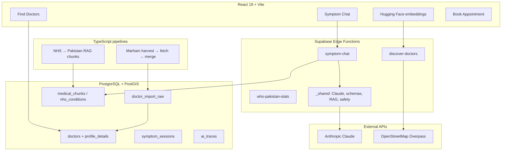

# HealthPilot AI

**Bilingual healthcare navigation for Pakistan** — AI symptom guidance, a verified doctor directory (Marham-sourced), and live nearby hospitals from OpenStreetMap.

> **Not a medical diagnosis tool.** AI output is informational only. Always consult a qualified clinician.

---

## At a glance (30 seconds)

| | |
|---|---|
| **Problem** | Patients struggle to choose the right specialty and find trustworthy doctors across Pakistan’s cities. |
| **Solution** | Conversational AI routes symptoms → specialty, then surfaces **real doctors** (scraped + normalized from Marham) and **live OSM facilities** near the user. |
| **Users** | Patients (EN / Urdu), optional login for history & appointments |
| **Scale** | 500+ Marham doctor profiles ingested; nationwide city coverage; PostGIS radius search |
| **AI** | Anthropic Claude with **tool calling** (structured JSON), model fallback chain, RAG-ready medical chunks |
| **Stack** | React 19 · TypeScript · Supabase · Edge Functions · Leaflet/OSM |

**Live routes:** Symptom Checker · Find Doctors · Nearby Facilities · Book Appointment (guest-friendly) · Health Statistics (WHO Pakistan)

---

## System architecture



---

## What this repo demonstrates

### 1. AI symptom navigation
- Multi-turn **Claude tool calling** (`ask_follow_up` → `submit_symptom_analysis`)
- **Client-side emergency triage** (&lt;1ms) before LLM latency
- Zod validation, severity normalization, bilingual summaries (EN / Urdu)
- **Observability:** `ai_traces` (model, tokens, latency, `trace_id`)
- **Eval harness:** `eval/run-eval.ts` + `eval/cases.jsonl`
- **RAG path:** NHS conditions + Pakistan corpus → `medical_chunks` (pgvector)

### 2. Doctor directory (production-style data pipeline)
- **Marham connector:** sitemap harvest → HTML parse → normalized rows
- Fields: specialty, fee, hospital, area/city, practice timings, services, WhatsApp
- **Review queue** → merge → `publication_status = published`
- **PostGIS** search: `search_doctors_directory`, `doctors_within_radius`
- **Data quality jobs:** repair-marham, backfill-cities, backfill-locations, purge-seed

### 3. Live facility discovery (OSM)
- No static hospital list — **Overpass + Nominatim** at query time
- GPS-first ranking; specialty-aware scoring
- Separate from doctor directory (clinics/hospitals on the map)

### 4. Engineering quality
- TypeScript end-to-end (app + pipelines + tests)
- **Vitest** unit tests (triage, specialty filter, geo, Marham HTML extract)
- **GitHub Actions:** lint → test → build
- i18n (English / Urdu), accessible UI (shadcn/ui + Tailwind)

---

## Tech stack

| Layer | Technology |
|--------|------------|
| Frontend | React 19, TypeScript, Vite 8, Tailwind 4, shadcn/ui, Zustand, react-i18next |
| Backend | Supabase Auth, Postgres, PostGIS, Realtime, Edge Functions (Deno) |
| AI | Anthropic Claude (Sonnet → Haiku fallback), tool use, optional RAG |
| Embeddings | BAAI/bge-large-en-v1.5 (Hugging Face or FastAPI sidecar) |
| Maps | Leaflet + OpenStreetMap (no Google Maps billing) |
| Data ingest | `tsx` CLI pipelines, rate-limited HTTP, Cheerio HTML parse |

---

## Repository map

```
HealthPilot-AI/
├── src/                      # React application
│   ├── pages/                # Symptom checker, doctors, facilities, booking
│   ├── services/             # Supabase + discovery API clients
│   ├── components/           # UI, maps, doctor cards, chat
│   └── utils/                # Triage, geo, Marham display helpers
├── supabase/
│   ├── functions/            # Edge: symptom-chat, discover-doctors, …
│   └── migrations/           # Schema, PostGIS, directory, RAG (001–014)
├── pipeline/
│   ├── doctors/              # Marham / multi-source doctor ingest
│   └── nhs/                  # NHS scrape → localize → embed
├── eval/                     # LLM evaluation dataset + runner
├── services/embedding-api/   # FastAPI embedding service (Railway)
├── docs/                     # Architecture, API, AI, engineering notes
└── .github/workflows/ci.yml
```

---

## Quick start

**Prerequisites:** Node.js 20+, Supabase project, Anthropic API key (edge secret)

```bash
git clone https://github.com/Faran-samra/HealthPilot-AI.git
cd HealthPilot-AI
npm install
cp .env.example .env   # add VITE_SUPABASE_URL + VITE_SUPABASE_ANON_KEY
npm run dev            # http://localhost:5173
```

**Supabase (one-time):**

```bash
npx supabase db push
npx supabase secrets set ANTHROPIC_API_KEY=sk-ant-...
npx supabase functions deploy symptom-chat
npx supabase functions deploy discover-doctors
npx supabase functions deploy who-pakistan-stats
```

Full setup: [docs/SETUP.md](./docs/SETUP.md)

---

## Doctor data pipeline (Marham)

```bash
npm run doctors:harvest -- --source marham --limit 2000
npm run doctors:fetch -- --source marham --limit 100    # repeat
npm run doctors:merge -- --auto-approve --publish --limit 500
npm run doctors:repair-marham -- --all --limit 500      # refresh profiles
```

Details: [docs/DOCTOR_DIRECTORY.md](./docs/DOCTOR_DIRECTORY.md) · [pipeline/doctors/README.md](./pipeline/doctors/README.md)

---

## Scripts

| Command | Purpose |
|---------|---------|
| `npm run dev` | Local dev server |
| `npm run build` | Production build |
| `npm run test` | Vitest (app + pipeline unit tests) |
| `npm run lint` | ESLint |
| `npm run eval` | LLM eval vs `analyze-symptoms` / chat |
| `npm run doctors:*` | Directory harvest, fetch, merge, repair |
| `npm run nhs:*` | NHS → RAG ingest pipeline |

---

## Documentation

| Doc | Audience |
|-----|----------|
| [docs/README.md](./docs/README.md) | Documentation index |
| [docs/architecture.md](./docs/architecture.md) | System design & flows |
| [docs/AI_SYSTEMS.md](./docs/AI_SYSTEMS.md) | Claude, tools, RAG, evals, safety |
| [docs/DOCTOR_DIRECTORY.md](./docs/DOCTOR_DIRECTORY.md) | Ingest pipeline & data model |
| [docs/ENGINEERING.md](./docs/ENGINEERING.md) | Key technical decisions |
| [docs/api-contracts.md](./docs/api-contracts.md) | Edge function API reference |
| [docs/safety.md](./docs/safety.md) | Disclaimers & safety rules |

---

## Security & compliance notes

- API keys live in **Supabase secrets** only (never shipped to the browser)
- Row Level Security on user-owned tables
- AI outputs include mandatory medical disclaimers
- Doctor data: public Marham pages with `source` + `source_url` attribution
- Service role key used only in server-side scripts and edge functions

---

## Author

Built as a portfolio-grade full-stack + AI systems project for Pakistan healthcare access.

**Repository:** [github.com/Faran-samra/HealthPilot-AI](https://github.com/Faran-samra/HealthPilot-AI)

---

## License

Private / portfolio — contact author for usage terms.
