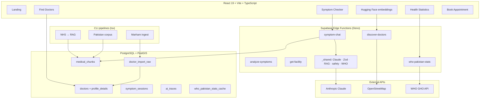

# HealthPilot AI

**Bilingual healthcare navigation for Pakistan** — conversational AI symptom guidance, a **7,000+** doctor directory (Marham-sourced), live hospitals from **OpenStreetMap**, and **WHO** public health statistics. Built as a production-style full-stack + **Generative AI / LLMOps** portfolio system.

[](https://health-pilot-ai-three.vercel.app/)
[](https://www.typescriptlang.org/)
[](https://react.dev/)
[](https://supabase.com/)
[](https://www.anthropic.com/)
[](./.github/workflows/ci.yml)

| | |
|---|---|
| **Live app** | **[health-pilot-ai-three.vercel.app](https://health-pilot-ai-three.vercel.app/)** |
| **Repository** | [github.com/Faran-samra/HealthPilot-AI](https://github.com/Faran-samra/HealthPilot-AI) |
| **Stack** | React 19 · Vite · TypeScript · Supabase · PostGIS · Anthropic Claude · OSM · WHO GHO |

> **Medical disclaimer:** HealthPilot AI is **informational guidance only**, not a diagnosis or prescription. Always consult a qualified clinician. In emergencies, call **Rescue 1122** or **Edhi 115**.

---

## Table of contents

- [What this project is](#what-this-project-is)
- [Skills demonstrated](#skills-demonstrated)
- [What you can do in the app](#what-you-can-do-in-the-app)
- [System architecture](#system-architecture)
- [AI & LLMOps (detailed)](#ai--llmops-detailed)
- [Doctor directory & data pipeline](#doctor-directory--data-pipeline)
- [WHO Pakistan health statistics](#who-pakistan-health-statistics)
- [Tech stack](#tech-stack)
- [Database & migrations](#database--migrations)
- [Repository structure](#repository-structure)
- [Getting started](#getting-started)
- [Deployment](#deployment)
- [Scripts reference](#scripts-reference)
- [Testing & CI](#testing--ci)
- [Security & compliance](#security--compliance)
- [Documentation](#documentation)
- [License](#license)

---

## What this project is

Pakistan’s healthcare system is large but fragmented: patients often do not know **which specialist to see**, struggle to compare **doctors by city, fee, and hospital**, and lack one place for **trustworthy national health context**.

**HealthPilot AI** solves that with a single free web app (English + Urdu):

1. **Describe symptoms** in a short AI conversation.
2. Receive **urgency**, **likely concerns**, **first-aid tips**, **red flags**, and a **recommended specialty** (not a diagnosis).
3. **Find real doctors** from a nationwide directory with fees, hospitals, and practice timings.
4. **See nearby hospitals/clinics** on a live map (OpenStreetMap).
5. Explore **WHO Pakistan statistics** in plain language.

The product is **guest-first** (symptom checker and doctor search work without signup). Optional auth unlocks dashboard, symptom history, and appointments.

---

## Skills demonstrated

This repository is designed to read well for **AI Engineer**, **LLMOps**, **Generative AI**, **NLP**, and **AI Systems Builder** roles.

| Skill area | Evidence in this repo |
|------------|------------------------|
| **Generative AI** | Multi-turn symptom chat (Claude), structured analysis, bilingual (EN/Urdu) summaries |
| **NLP** | Symptom understanding, medical corpus ingest, embeddings, vector retrieval |
| **LLMOps** | `ai_traces`, model fallback chains, `eval/` regression harness, prompt + tool schemas |
| **RAG** | NHS conditions → Pakistan localization → `medical_chunks` (pgvector) → retrieval in `symptom-chat` |
| **AI systems** | Edge gateway, Zod validation, client triage, safety rules, timeout-bound retrieval |
| **Full-stack** | React SPA, Supabase Auth/RLS, PostGIS search, Leaflet maps, Vercel deploy |
| **Data engineering** | Marham ETL (harvest → fetch → review → publish), repair/backfill jobs |
| **Computer vision** | *Not in scope for this project* |

---

## What you can do in the app

### Symptom checker (`/symptom-checker`)

- Chat-style UI with **quick symptom chips**, progress steps, and bilingual copy.
- **Client-side emergency triage** (`src/utils/symptomTriage.ts`) — keyword detection in &lt;1ms before any LLM call.
- **Multi-turn follow-ups** via Claude **tool calling** (`ask_follow_up`), then final **`submit_symptom_analysis`**.
- Results panel: severity badge, specialist, explanation, Urdu summary, possible conditions, first-aid tips, red flags (always visible cards).
- **Recommended directory doctors** + **OSM facilities** near GPS or city.
- Actions: Find specialist, nearby facilities, **Doctors near me** (correct directory link), book via Marham.
- **“Get results now”** shortcut after 2 turns to skip slow third-message analysis path.
- Optional **session save** for logged-in users; **analysis feedback** linked to `trace_id`.

### Find doctors (`/doctors`)

- **7,000+** published profiles from **Marham.pk** (with `source` + `source_url` attribution).
- Filters: **city**, **specialty**, **name**, **fee range**, **female doctors only**, **Near Me** (GPS).
- **PostGIS** distance sorting and multi-city merge when Near Me results are sparse.
- **Directory cache** + **scroll position restore** when returning from a profile.
- Profile pages: fee (PKR), hospital/clinic, practice timings, services, diseases, WhatsApp, Marham booking.
- **Doctor claim** form for correction requests (review queue).

### Healthcare facilities (`/healthcare-facilities`)

- **Live** hospitals/clinics from **Overpass API** + **Nominatim** (not a static list).
- Leaflet map, specialty-aware ranking, bilingual address formatting (`src/utils/facilityDisplay.ts`).
- Separate from the doctor table — amenities vs individual practitioners.

### Health statistics (`/health-statistics`)

- KPIs from **WHO Global Health Observatory** (life expectancy, population, maternal/under-5 mortality, TB, malaria, NCD risk, health spend).
- **Leading causes of death (WHO GHE 2021)** — heart disease, COVID-19, stroke, etc., with deaths per 100k and patient tips.
- 24h edge cache; manual refresh; compact WHO attribution strip.

### Other routes

| Route | Purpose |
|-------|---------|
| `/` | Landing — product story, stats, WHO block, how it works (no forced register) |
| `/health-info` | Pakistan-focused awareness (dengue, typhoid, hepatitis, diabetes) |
| `/doctors/:id` | Doctor profile |
| `/doctors/:id/book` | Guest booking — slots from practice timings, Marham call-center link |
| `/places/:id` | OSM facility detail |
| `/login`, `/register`, `/dashboard`, `/profile`, `/appointments` | Optional auth flows |

---

## System architecture



### Symptom → doctor flow

1. User sends message (EN or Urdu).
2. Client runs **triage** + optional **symptom pattern cache**.
3. `symptom-chat` chooses **follow-up** or **finalize** (turn count / force button / emergency).
4. On finalize: optional **RAG** (2.5s timeout, top 3 chunks) → Claude analysis → **Zod** + **safety rules**.
5. UI shows results; loads **directory doctors** (specialty + city/GPS) and **OSM facilities**.
6. User books via **Marham** or browses facilities.

---

## AI & LLMOps (detailed)

### Why tool calling (not raw JSON)

Claude is invoked with **forced tools** so outputs are always structured:

| Tool | When | Output |
|------|------|--------|
| `ask_follow_up` | Chat mode | One question + `quick_severity` |
| `submit_symptom_analysis` | Finalize | Full analysis object (specialty slug, severity, tips, Urdu summary, etc.) |

Validated server-side with **Zod** (`supabase/functions/_shared/schemas.ts`). Avoids `JSON.parse` failures on Urdu-heavy responses.

### Models & performance

| Phase | Model preference | `max_tokens` |
|-------|------------------|--------------|
| Follow-up | Haiku → Sonnet | 320 |
| Analysis | Haiku → Sonnet (fallback chain) | 1024 |

- **RAG:** `retrieveMedicalContextWithTimeout` — 2.5s cap, 3 chunks; Pakistan sources prioritized.
- **Client:** Non-blocking session save; separate loading UI for chat vs analysis.

### Observability & evals

| Component | Purpose |
|-----------|---------|
| `ai_traces` | `trace_id`, model, tokens, latency, status per call |
| `analysis_feedback` | Thumbs up/down linked to `trace_id` |
| `eval/run-eval.ts` | Regression over `eval/cases.jsonl` against deployed edge functions |
| `analyze-symptoms` | Legacy single-shot endpoint (still used by eval) |

### RAG ingest path

```
NHS UK conditions (scrape)
  → Pakistan localization (1122, Edhi, hospital OPD)
  → chunk (pipeline/nhs/4-build-chunks.ts)
  → embed BAAI/bge-large-en-v1.5 (HF Inference or embedding-api)
  → medical_chunks (pgvector)

corpus/pakistan-guidelines/ → seed-pakistan-corpus.ts
```

Key files: `supabase/functions/symptom-chat/index.ts`, `supabase/functions/_shared/rag.ts`, `src/components/symptoms/SymptomChatInterface.tsx`, `src/utils/symptomTriage.ts`.

Deep dive: [docs/AI_SYSTEMS.md](./docs/AI_SYSTEMS.md)

---

## Doctor directory & data pipeline

### Design

Public Marham profile pages are ingested through a **staging → review → publish** pipeline so bad rows never hit production without inspection.

```text
sitemap / city listings
    → doctors:harvest (URLs → doctor_import_raw)
    → doctors:fetch (HTML → normalized_payload)
    → doctors:review (approve/reject)
    → doctors:merge --publish (→ doctors table)
    → Find Doctors UI
```

### Per-doctor data

| Field | Notes |
|-------|--------|
| Name, specialty, qualification | Parsed from profile HTML |
| Hospital, area, address, `city_slug` | Area line + URL slug resolver (`pakistanCityExtract.ts`) |
| `consultation_fee` | From practice block only (not sidebar promos) |
| `profile_details` | JSON: services, diseases, timings, WhatsApp |
| `available_times` | Weekly `practice_timings` |
| `latitude` / `longitude` | Geocoded or city-center fallback |
| `source`, `source_url` | `marham` + canonical URL |

### Quality & maintenance jobs

| Command | Purpose |
|---------|---------|
| `doctors:marham-ingest` | Bulk harvest + fetch + publish orchestration |
| `doctors:repair-marham` | Refresh stale profile fields |
| `doctors:backfill-cities` | Fix city_slug from URL/area |
| `doctors:backfill-locations` | Lat/lng repair |
| `doctors:backfill-fees` / `backfill-gender` | Field repair |
| `doctors:purge-garbage-marham` | Remove low-quality rows |
| `doctors:clean-workplaces` | Normalize hospital names |
| `doctors:purge-seed` | Remove demo seed doctors |

### Search (Postgres)

- RPCs: `search_doctors_directory`, `doctors_within_radius` (migrations `010`–`014`).
- Fuzzy specialty matching (`012_specialty_filter_fuzzy.sql`).
- App layer: `src/services/doctorService.ts` — city listing, Near Me annotation, client quality filter (`doctorSanitize.ts`).

Deep dive: [docs/DOCTOR_DIRECTORY.md](./docs/DOCTOR_DIRECTORY.md) · [pipeline/doctors/README.md](./pipeline/doctors/README.md)

---

## WHO Pakistan health statistics

- Edge function **`who-pakistan-stats`** — fetches live KPIs from [WHO GHO API](https://ghoapi.azureedge.net/api), serves **GHE 2021** leading causes (aligned with [data.who.int](https://data.who.int/countries/586)).
- Correct national aggregates (e.g. under-5 mortality ~60/1,000, not disaggregated breakdown rows).
- **24-hour cache** in `who_pakistan_stats_cache`.
- UI: patient-friendly cards, year badges, share chart among top 5 causes.

---

## Tech stack

| Layer | Technologies |
|--------|----------------|
| **Frontend** | React 19, TypeScript, Vite 8, Tailwind CSS 4, shadcn/ui, Radix, Zustand, React Router 7 |
| **i18n** | react-i18next (`public/locales/en.json`, `ur.json`) |
| **Maps** | Leaflet, react-leaflet, OpenStreetMap (Overpass + Nominatim) |
| **Backend** | Supabase (Auth, Postgres, **PostGIS**, RLS, Realtime) |
| **Serverless** | Supabase Edge Functions (Deno), shared `_shared` modules |
| **AI** | Anthropic Claude (Haiku/Sonnet), tool use, Zod |
| **Embeddings** | BAAI/bge-large-en-v1.5 — Hugging Face Inference or `services/embedding-api` |
| **Pipelines** | `tsx`, Cheerio, rate-limited HTTP, async pool for parallel fetch |
| **Quality** | Vitest, ESLint, GitHub Actions (`lint` → `test` → `build`) |
| **Hosting** | Vercel (frontend), Supabase (backend) |

---

## Database & migrations

Migrations `001`–`014` in `supabase/migrations/`:

| Migration | Topic |
|-----------|--------|
| `001` | Core schema — profiles, doctors, appointments, symptom_sessions |
| `002` | Medical specialties seed |
| `003` | PostGIS functions |
| `004`–`006` | Doctor gender, realtime appointments, nationwide location |
| `007` | LLMOps — `ai_traces`, `medical_chunks`, pgvector |
| `008` | NHS conditions |
| `009` | WHO stats cache |
| `010`–`014` | Directory expansion, phase B import, fuzzy specialty, profile details, seed cleanup |

---

## Repository structure

```text
HealthPilot-AI/
├── src/
│   ├── pages/                 # All routes (Landing, SymptomChecker, FindDoctorsDirectory, …)
│   ├── components/
│   │   ├── symptoms/          # Chat UI, analysis panel, action cards
│   │   ├── doctors/           # Directory cards, map, claim form
│   │   └── health/who-stats/  # WHO statistics widgets
│   ├── services/              # Supabase + edge invocations
│   ├── store/                 # authStore, symptomStore, doctorsDirectoryStore
│   └── utils/                 # triage, geo, Marham, facility display, i18n helpers
├── supabase/
│   ├── functions/             # symptom-chat, discover-doctors, who-pakistan-stats, …
│   │   └── _shared/           # claude, rag, schemas, safety, who-gho
│   └── migrations/            # 001–014 SQL
├── pipeline/
│   ├── doctors/               # Marham/Oladoc/HamariWeb connectors + jobs
│   └── nhs/                   # NHS scrape → localize → embed
├── eval/                      # cases.jsonl + Deno runner
├── services/embedding-api/    # Optional FastAPI HF proxy (Railway)
├── corpus/pakistan-guidelines/
├── public/locales/
├── docs/                      # Architecture, API, AI, setup, safety
├── .github/workflows/ci.yml
└── vercel.json                # SPA rewrites for client-side routes
```

---

## Getting started

### Prerequisites

- Node.js **20+**
- [Supabase](https://supabase.com) project
- [Anthropic](https://www.anthropic.com/) API key (for symptom AI)
- Optional: [Hugging Face](https://huggingface.co/) token for RAG embeddings

### Install & run locally

```bash
git clone https://github.com/Faran-samra/HealthPilot-AI.git
cd HealthPilot-AI
npm install
cp .env.example .env
```

| Variable | Where | Purpose |
|----------|--------|---------|
| `VITE_SUPABASE_URL` | `.env` | Frontend Supabase URL |
| `VITE_SUPABASE_ANON_KEY` | `.env` | Public anon key |
| `SUPABASE_SERVICE_ROLE_KEY` | `.env` (pipelines only) | Doctor ingest — **never** commit |
| `ANTHROPIC_API_KEY` | Supabase secret | Edge functions |
| `HUGGINGFACE_API_KEY` | Supabase secret (optional) | RAG embeddings |

```bash
npx supabase link --project-ref YOUR_PROJECT_REF
npx supabase db push
npx supabase secrets set ANTHROPIC_API_KEY=sk-ant-...
npx supabase secrets set SUPABASE_SERVICE_ROLE_KEY=your-service-role-key

npx supabase functions deploy symptom-chat
npx supabase functions deploy discover-doctors
npx supabase functions deploy who-pakistan-stats
npx supabase functions deploy get-facility

npm run dev
```

Open [http://localhost:5173](http://localhost:5173).

Full guide: [docs/SETUP.md](./docs/SETUP.md)

---

## Deployment

| Component | Platform | Notes |
|-----------|----------|--------|
| **Frontend** | [Vercel](https://vercel.com) | Connect GitHub repo; set `VITE_SUPABASE_*` env vars; uses `vercel.json` for SPA routing |
| **Backend** | [Supabase](https://supabase.com) | DB + Auth + Edge Functions (free tier to start) |
| **Live demo** | https://health-pilot-ai-three.vercel.app/ | Production build from `main` |

Doctor ingest pipelines run **locally** (or CI) with the service role key — not on Vercel.

---

## Scripts reference

### App

| Command | Description |
|---------|-------------|
| `npm run dev` | Local dev server |
| `npm run build` | Production build → `dist/` |
| `npm run test` | Vitest (46+ unit tests) |
| `npm run lint` | ESLint |
| `npm run eval` | LLM eval harness |
| `npm run eval:report` | Write `docs/eval-results.md` |

### Doctor directory

| Command | Description |
|---------|-------------|
| `npm run doctors:harvest` | Collect profile URLs from sitemaps |
| `npm run doctors:fetch` | Download & parse HTML |
| `npm run doctors:review` | Review queue approve/reject |
| `npm run doctors:merge` | Merge to `doctors` (`--publish`, `--auto-approve`) |
| `npm run doctors:marham-ingest` | Orchestrated bulk Marham run |
| `npm run doctors:repair-marham` | Refresh profile fields |
| `npm run doctors:backfill-cities` | City slug repair |
| `npm run doctors:backfill-locations` | Coordinates repair |
| `npm run doctors:purge-garbage-marham` | Remove bad rows |

### RAG / NHS

| Command | Description |
|---------|-------------|
| `npm run nhs:scrape` | Scrape NHS conditions |
| `npm run nhs:localize` | Pakistan localization layer |
| `npm run nhs:chunks` | Build chunks |
| `npm run nhs:embed` | Embed into `medical_chunks` |
| `npm run corpus:seed-pk` | Seed Pakistan guideline corpus |

---

## Testing & CI

Every push to `main` runs [GitHub Actions](./.github/workflows/ci.yml):

```bash
npm run lint    # ESLint (TypeScript + React)
npm run test    # Vitest
npm run build   # tsc + Vite production build
```

**Test coverage highlights:** symptom triage, specialty filters, Marham URL/HTML parsing, geo helpers, booking utilities, doctor display sanitization.

---

## Security & compliance

- API keys only in **Supabase secrets** or local `.env` — never in the client bundle.
- **Row Level Security** on user-owned data (`profiles`, `symptom_sessions`, appointments).
- Mandatory **medical disclaimers** on AI and WHO pages.
- **Marham attribution** via `source` + `source_url` on directory rows.
- Service role key used only in edge functions and trusted CLI scripts.

Details: [docs/safety.md](./docs/safety.md)

---

## Documentation

| Document | Description |
|----------|-------------|
| [docs/README.md](./docs/README.md) | Documentation index |
| [docs/SETUP.md](./docs/SETUP.md) | Setup & deploy checklist |
| [docs/architecture.md](./docs/architecture.md) | Flows & design decisions |
| [docs/AI_SYSTEMS.md](./docs/AI_SYSTEMS.md) | Claude, tools, RAG, evals |
| [docs/DOCTOR_DIRECTORY.md](./docs/DOCTOR_DIRECTORY.md) | Ingest & search |
| [docs/ENGINEERING.md](./docs/ENGINEERING.md) | Trade-offs |
| [docs/api-contracts.md](./docs/api-contracts.md) | Edge API shapes |
| [docs/safety.md](./docs/safety.md) | Safety rules |
| [.github/REPOSITORY_ABOUT.md](./.github/REPOSITORY_ABOUT.md) | GitHub About box copy-paste |

---

## Author

**HealthPilot AI** — portfolio project demonstrating end-to-end **AI systems** and **healthcare product engineering** for Pakistan.

- **Live demo:** [https://health-pilot-ai-three.vercel.app/](https://health-pilot-ai-three.vercel.app/)
- **GitHub:** [@Faran-samra / HealthPilot-AI](https://github.com/Faran-samra/HealthPilot-AI)

---

## License

Private / portfolio — contact the author for usage terms.
