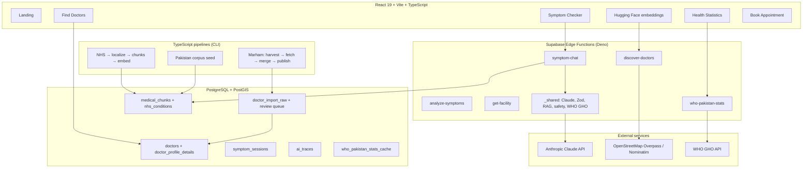

# HealthPilot AI

**Bilingual healthcare navigation for Pakistan** — AI symptom guidance, a nationwide doctor directory, live nearby hospitals from OpenStreetMap, and WHO public health statistics.

[](https://health-pilot-ai-three.vercel.app/)
[](https://www.typescriptlang.org/)
[](https://react.dev/)
[](https://supabase.com/)
[](./.github/workflows/ci.yml)

| | |
|---|---|
| **Live app** | **[health-pilot-ai-three.vercel.app](https://health-pilot-ai-three.vercel.app/)** |
| **Source code** | [github.com/Faran-samra/HealthPilot-AI](https://github.com/Faran-samra/HealthPilot-AI) |

> **Medical disclaimer:** HealthPilot AI provides **informational guidance only**, not a diagnosis or prescription. Always consult a qualified clinician for personal medical decisions. In emergencies, call **Rescue 1122** or **Edhi 115**.

---

## Executive summary (for recruiters)

HealthPilot AI is a **full-stack, AI-powered health access platform** built for Pakistan. Patients describe symptoms in **English or Urdu**; the system suggests an appropriate **medical specialty and urgency**, then connects them to **real doctors** (7,000+ profiles ingested from Marham) and **live hospitals/clinics** (OpenStreetMap). The backend uses **Supabase (Postgres + PostGIS + Edge Functions)**; the AI layer uses **Anthropic Claude with tool calling**, optional **RAG** over medical chunks, and an **eval harness** for regression testing.

This repository demonstrates:

- **Product engineering** — landing, symptom checker, directory UX (Near Me, filters, scroll restore), booking flows, i18n
- **Data engineering** — Marham scrape → staging → review → publish pipeline; city/location repair jobs
- **AI systems** — multi-turn chat, structured outputs, model fallbacks, client-side emergency triage, traces
- **Geo & search** — PostGIS radius search, multi-city merge, OSM Overpass discovery
- **DevOps quality** — Vitest, ESLint, GitHub Actions CI, typed API clients

---

## Problem & solution

| | |
|---|---|
| **Problem** | Patients in Pakistan often do not know which specialist to see, struggle to compare doctors by city/fee/hospital, and lack a single place for trustworthy public health context. |
| **Solution** | A free web app: conversational AI routes symptoms → specialty + urgency → **directory doctors** + **OSM facilities** near GPS or selected city, plus **WHO Pakistan statistics** in plain language. |
| **Users** | Patients (guest or registered); optional login for symptom history, profile, and appointments |
| **Languages** | English and Urdu (`react-i18next`, RTL-aware UI) |
| **Scale (directory)** | **7,000+** published doctor profiles · **50+** cities · Marham-sourced metadata (fee, hospital, timings) |

---

## Features

### Symptom checker (AI)

- Multi-turn chat on `/symptom-checker` with follow-up questions before final analysis
- **Claude tool calling:** `ask_follow_up` → `submit_symptom_analysis` (structured JSON, no fragile free-form parsing)
- **Client-side emergency triage** (`symptomTriage.ts`) — keyword detection before LLM latency
- Results: severity, specialty, possible conditions, first-aid tips, red flags, Urdu summary
- Links to **Find Doctors** (specialty + Near Me) and **Healthcare Facilities** (OSM)
- Optional **RAG** from `medical_chunks` (NHS conditions localized for Pakistan + Pakistan guideline corpus)
- **Observability:** `ai_traces` (model, tokens, latency, `trace_id`)

### Find doctors (directory)

- Search by **name, specialty, city, area, fee**, female doctors, **Near Me** (GPS)
- Doctor profiles: hospital, fee (PKR), practice timings, services, Marham booking link
- **PostGIS** search (`search_doctors_directory`, distance annotation)
- Data quality: sanitize display names, city backfill, location repair, garbage-row purge
- **Doctor claim** flow for profile corrections (review queue)

### Nearby healthcare facilities (OpenStreetMap)

- Live hospitals/clinics from **Overpass API + Nominatim** (not a static hospital list)
- Map view (Leaflet), specialty-aware ranking, bilingual address display
- Separate from the doctor directory — amenities vs individual practitioner profiles

### Health statistics (WHO)

- `/health-statistics` — Pakistan indicators from **WHO Global Health Observatory**
- Life expectancy, population, maternal/child mortality, TB, malaria, NCD risk, health spend
- **Leading causes of death (WHO GHE 2021)** with patient-friendly explanations
- 24-hour edge cache + manual refresh

### Other

- **Landing page** — product overview, how it works, WHO section (no forced signup)
- **Health info** — dengue, typhoid, hepatitis, diabetes awareness (Pakistan context)
- **Book appointment** — guest-friendly; Marham call-center / profile deep links
- **Auth** (optional) — Supabase Auth, dashboard, symptom session history

---

## System architecture



### Request flow: symptom → doctor

1. User enters symptoms (EN/UR).
2. Client runs **triage** (emergency keywords, quick severity).
3. `symptom-chat` calls Claude with tools; may ask 1–2 follow-ups.
4. Final analysis returns specialty slug, severity, tips, disclaimers.
5. UI loads **directory doctors** (PostGIS / city) and **OSM facilities** (GPS).
6. User opens profile → book via Marham or call center.

---

## Tech stack

| Layer | Technologies |
|--------|----------------|
| **Frontend** | React 19, TypeScript, Vite 8, Tailwind CSS 4, shadcn/ui, Zustand, React Router 7, react-i18next |
| **Maps** | Leaflet, react-leaflet, OpenStreetMap (no Google Maps billing) |
| **Backend** | Supabase Auth, PostgreSQL, **PostGIS**, Row Level Security, Realtime |
| **Serverless** | Supabase Edge Functions (Deno), shared modules for AI/RAG/WHO |
| **AI** | Anthropic Claude (Sonnet → Haiku fallback), tool use, Zod validation |
| **Embeddings / RAG** | BAAI/bge-large-en-v1.5 (Hugging Face Inference or FastAPI sidecar), pgvector |
| **Data ingest** | `tsx` CLI pipelines, Cheerio HTML parsing, rate-limited HTTP |
| **Testing** | Vitest (unit tests: triage, geo, Marham extract, specialty filter) |
| **CI** | GitHub Actions — lint, test, build |

---

## Data pipelines

### Doctor directory (Marham)

Production-style ETL with a **staging → review → publish** model:

```
sitemap harvest → fetch HTML profiles → normalize → doctor_import_raw
    → review queue → merge → doctors (publication_status = published)
```

| Stage | Command (examples) |
|--------|---------------------|
| Harvest URLs | `npm run doctors:harvest -- --source marham --limit 2000` |
| Fetch profiles | `npm run doctors:fetch -- --source marham --limit 100` |
| Merge & publish | `npm run doctors:merge -- --auto-approve --publish --limit 500` |
| Repair / backfill | `npm run doctors:repair-marham`, `doctors:backfill-cities`, `doctors:backfill-locations` |
| Quality | `npm run doctors:purge-garbage-marham`, `doctors:clean-workplaces` |

See [docs/DOCTOR_DIRECTORY.md](./docs/DOCTOR_DIRECTORY.md) and [pipeline/doctors/README.md](./pipeline/doctors/README.md).

### Medical knowledge (RAG)

1. **NHS UK conditions** — scrape → **Pakistan localization** (1122, Edhi, hospital OPD) → chunk → embed → `medical_chunks`
2. **Pakistan corpus** — `corpus/pakistan-guidelines/` → seed script
3. At inference, `symptom-chat` retrieves chunks (Pakistan sources prioritized)

### WHO Pakistan statistics

- Edge function `who-pakistan-stats` fetches **WHO GHO API** (KPIs) and serves **GHE 2021 leading causes**
- Cached in `who_pakistan_stats_cache` (24h TTL)

---

## Edge functions

| Function | Purpose |
|----------|---------|
| `symptom-chat` | Primary multi-turn symptom conversation + analysis |
| `analyze-symptoms` | Single-shot analysis (evals, legacy) |
| `discover-doctors` | OSM facility/doctor discovery, hybrid modes, geocoding |
| `get-facility` | Facility detail helper |
| `who-pakistan-stats` | WHO KPIs + leading causes for Pakistan |

Deploy:

```bash
npx supabase functions deploy symptom-chat
npx supabase functions deploy discover-doctors
npx supabase functions deploy who-pakistan-stats
```

---

## Repository structure

```
HealthPilot-AI/
├── src/                          # React application
│   ├── pages/                    # Routes: landing, symptoms, doctors, facilities, WHO stats
│   ├── components/               # UI, maps, chat, doctor cards, WHO widgets
│   ├── services/                 # Supabase clients, discovery, WHO stats
│   ├── store/                    # Zustand (auth, directory cache)
│   └── utils/                    # Triage, geo, Marham helpers, i18n
├── supabase/
│   ├── functions/                # Edge functions + _shared
│   └── migrations/               # Schema 001–014 (PostGIS, directory, RAG, WHO cache)
├── pipeline/
│   ├── doctors/                  # Marham / multi-source ingest
│   └── nhs/                      # NHS → Pakistan RAG pipeline
├── eval/                         # LLM eval dataset + Deno runner
├── services/embedding-api/       # Optional FastAPI embedding proxy (Railway)
├── corpus/pakistan-guidelines/   # Local Pakistan health corpus
├── public/locales/               # en.json, ur.json
├── docs/                         # Architecture, API, AI, setup, safety
└── .github/workflows/ci.yml
```

---

## Getting started

### Prerequisites

- **Node.js 20+**
- **Supabase** project ([supabase.com](https://supabase.com))
- **Anthropic API key** (Supabase secret for edge functions)
- Optional: **Hugging Face API key** for RAG embeddings

### 1. Clone and install

```bash
git clone https://github.com/Faran-samra/HealthPilot-AI.git
cd HealthPilot-AI
npm install
```

### 2. Environment

```bash
cp .env.example .env
```

| Variable | Required | Description |
|----------|----------|-------------|
| `VITE_SUPABASE_URL` | Yes | Supabase project URL |
| `VITE_SUPABASE_ANON_KEY` | Yes | Supabase anon (public) key |
| `SUPABASE_SERVICE_ROLE_KEY` | Pipelines / eval | Server-side scripts only — never commit |
| `ANTHROPIC_API_KEY` | Edge (secret) | Set via `supabase secrets set` |
| `HUGGINGFACE_API_KEY` | RAG (optional) | Embeddings for `medical_chunks` |

### 3. Database & functions

```bash
npx supabase link --project-ref YOUR_PROJECT_REF
npx supabase db push
npx supabase secrets set ANTHROPIC_API_KEY=sk-ant-...
npx supabase functions deploy symptom-chat
npx supabase functions deploy discover-doctors
npx supabase functions deploy who-pakistan-stats
```

### 4. Run locally

```bash
npm run dev
```

Open [http://localhost:5173](http://localhost:5173).

Full setup: [docs/SETUP.md](./docs/SETUP.md)

---

## Scripts

| Command | Description |
|---------|-------------|
| `npm run dev` | Vite dev server |
| `npm run build` | Typecheck + production build |
| `npm run test` | Vitest unit tests |
| `npm run lint` | ESLint |
| `npm run eval` | LLM eval against edge functions |
| `npm run doctors:harvest` | Harvest doctor profile URLs (sitemap) |
| `npm run doctors:fetch` | Fetch & parse profile HTML |
| `npm run doctors:merge` | Review queue → publish to `doctors` |
| `npm run doctors:repair-marham` | Refresh Marham profile fields |
| `npm run nhs:scrape` / `nhs:localize` / `nhs:embed` | NHS → RAG pipeline |
| `npm run corpus:seed-pk` | Seed Pakistan guideline chunks |

---

## Testing & quality

```bash
npm run lint
npm run test
npm run build
```

- **Unit tests:** symptom triage, specialty matching, Marham HTML extraction, geo helpers
- **Eval harness:** `eval/run-eval.ts` + `eval/cases.jsonl` for LLM regression checks
- **CI:** `.github/workflows/ci.yml` runs on push/PR

---

## Security & compliance

- **API keys** live in Supabase secrets or local `.env` — never bundled in the client
- **Row Level Security** on user-owned tables (`profiles`, `symptom_sessions`, appointments)
- **Medical disclaimers** on AI outputs and WHO statistics pages
- **Doctor data attribution:** `source`, `source_url` on Marham-sourced rows
- **Service role key** only in edge functions and trusted CLI scripts

Details: [docs/safety.md](./docs/safety.md)

---

## Documentation

| Document | Description |
|----------|-------------|
| [docs/README.md](./docs/README.md) | Documentation index |
| [docs/SETUP.md](./docs/SETUP.md) | Full local + Supabase setup |
| [docs/architecture.md](./docs/architecture.md) | System design & core flows |
| [docs/AI_SYSTEMS.md](./docs/AI_SYSTEMS.md) | Claude, tools, RAG, evals, safety |
| [docs/DOCTOR_DIRECTORY.md](./docs/DOCTOR_DIRECTORY.md) | Ingest pipeline & schema |
| [docs/ENGINEERING.md](./docs/ENGINEERING.md) | Technical decisions |
| [docs/api-contracts.md](./docs/api-contracts.md) | Edge function API reference |
| [docs/safety.md](./docs/safety.md) | Disclaimers & safety rules |
| [CONTRIBUTING.md](./CONTRIBUTING.md) | Contribution guidelines |

---

## Screens & routes

| Route | Feature |
|-------|---------|
| `/` | Landing — product overview, WHO highlight |
| `/symptom-checker` | AI symptom chat |
| `/doctors` | Doctor directory + Near Me |
| `/healthcare-facilities` | OSM hospitals/clinics map |
| `/health-statistics` | WHO Pakistan public health data |
| `/health-info` | Common illnesses (Pakistan) |
| `/doctors/:id` | Doctor profile |
| `/doctors/:id/book` | Appointment booking |
| `/dashboard` | User dashboard (auth) |

---

## Author

Built as a **portfolio-grade full-stack + AI systems** project focused on healthcare access in Pakistan.

- **Live demo:** [https://health-pilot-ai-three.vercel.app/](https://health-pilot-ai-three.vercel.app/)
- **GitHub:** [@Faran-samra / HealthPilot-AI](https://github.com/Faran-samra/HealthPilot-AI)

---

## License

Private / portfolio — contact the author for usage terms.
