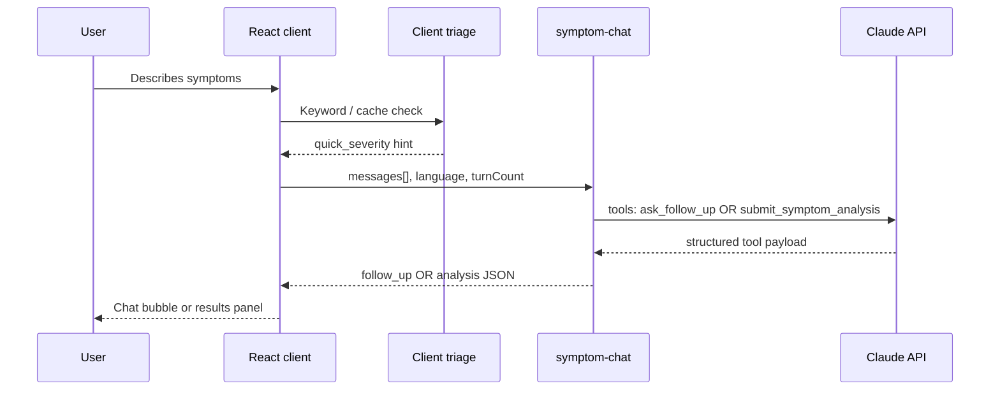

# AI systems

How HealthPilot uses large language models safely and reliably for symptom navigation in Pakistan.

## Overview

| Component | Role |
|-----------|------|
| `symptom-chat` | Primary multi-turn UX (tool calling) |
| `analyze-symptoms` | Single-shot analysis (evals, legacy) |
| `src/utils/symptomTriage.ts` | Client emergency keywords + pattern cache |
| `supabase/functions/_shared/*` | Schemas, safety, Claude client, RAG, traces |
| `eval/` | Regression dataset against edge functions |
| `medical_chunks` + RAG | Optional context from NHS / Pakistan corpus |

## Conversation flow



## Tool calling (why not raw JSON)

Claude is invoked with **forced tools**:

1. **`ask_follow_up`** — one clarifying question + `quick_severity`
2. **`submit_symptom_analysis`** — final structured analysis

Benefits:
- Avoids `JSON.parse` failures (especially with Urdu text in content)
- Schema enforced by tool definitions + server-side Zod (`_shared/schemas.ts`)
- Clear separation between “still chatting” and “done”

## Multi-model LLM router (cost + safety)

The symptom checker is **provider-agnostic** via `_shared/llm/` + `_shared/model-router.ts`:

| Provider | Model | Role |
|----------|--------|------|
| **OpenAI** | `gpt-4o-mini` | Default for most follow-ups and analysis |
| **Google Gemini** | `gemini-2.5-flash` (AI Studio) | Simple / low-complexity first turns |
| **Groq (Llama 3.1)** | `llama-3.1-8b-instant` | Fallback when upstream APIs fail |
| **Anthropic Claude** | `claude-sonnet-4-6` | High-risk (chest pain, stroke, etc.), ambiguous cases, validation failure, `condition_confidence: low` |

| Tier | When | Typical chain |
|------|------|----------------|
| **economy** | Benign first follow-up | Gemini → GPT-4o-mini → Llama |
| **standard** | Default | GPT-4o-mini → Llama → Gemini |
| **premium** | Emergency/severe/sensitive/ambiguous | Claude → GPT-4o-mini → Llama |

Signals: server keyword scan, `clientTriage`, `lastQuickSeverity`, RAG on premium/long analysis.

**Fallback chaining:** `invokeWithToolChain` tries each model in order; failures are logged in `attempts:` on the trace.

**Escalation:** validation errors or low confidence trigger a **Claude** retry chain.

### Supabase secrets (at least one required)

- `OPENAI_API_KEY`, `GEMINI_API_KEY` (or `GOOGLE_API_KEY`), `GROQ_API_KEY`, `ANTHROPIC_API_KEY`

Debug: `SYMPTOM_ROUTER_FORCE_TIER`, `SYMPTOM_LLM_FORCE_PROVIDER`.

Traces: `ai_traces.error_message` on success includes `route:…;chain:…;used:openai/gpt-4o-mini;attempts:…`.

## Safety layer

`_shared/safety.ts` + UI disclaimers:

- Severity clamping and red-flag surfacing
- Mandatory disclaimer fields in analysis output
- Not presented as diagnosis or prescription

See [safety.md](./safety.md).

## Observability

Each LLM call can log to **`ai_traces`**:

- `trace_id` (returned to client for feedback)
- Model name, token usage, latency
- Function name (`symptom-chat` / `analyze-symptoms`)

Users can submit thumbs up/down linked to `trace_id` in **`analysis_feedback`**.

## RAG (retrieval-augmented generation)

Enabled on **every final analysis** via `_shared/rag.ts`:

1. **Normalize** Roman Urdu / mixed input to English clinical concepts (`rag-query-normalize.ts` + `medical-synonyms.ts`) — e.g. peeli aankhen → jaundice / yellow eyes; bukhar → fever — before any embedding.
2. Embed the normalized English query (Hugging Face `BAAI/bge-large-en-v1.5`)
3. Vector search `medical_chunks` (pgvector, `match_medical_chunks`)
4. Re-rank candidates (`nhs-slug-registry.ts`, `condition-slug-inference.ts`, `rag-ranking.ts`): map symptoms to NHS `condition_slug` via rules + ~640-condition registry; boost matching chunks; drop tangential pages (e.g. diabetes insipidus for simple dehydration). If nothing is relevant enough, return no references rather than wrong ones.
5. Inject top chunks (similarity ≥ `RAG_MIN_SIMILARITY`, default 0.52) into the LLM system prompt.
6. Return `_rag.sources` to the client for a “Medical references used” card. Traces include `rag:Nchunks;boost=jaundice,hepatitis`. Set `RAG_DEBUG=true` to log normalized embedding preview (no PHI in production logs).

Pakistan chunks are prioritized over NHS UK; NHS text is background only (1122/Edhi in user-facing output).

**Ingest sources:**

- NHS Conditions (scraped, localized for Pakistan) — `pipeline/nhs/`
- Pakistan guidelines — `corpus/pakistan-guidelines/` + `scripts/seed-pakistan-corpus.ts`

## Evaluation harness

```bash
export VITE_SUPABASE_URL=...
export VITE_SUPABASE_ANON_KEY=...
npm run eval
npm run eval:report   # writes docs/eval-results.md
```

- Cases in `eval/cases.jsonl` (symptom text, expected specialty, severity bounds)
- Calls deployed edge functions (not mocked LLM)
- Useful for regression when changing prompts or models

## Key files

| File | Purpose |
|------|---------|
| `supabase/functions/symptom-chat/index.ts` | Main chat handler |
| `supabase/functions/_shared/claude.ts` | Anthropic client wrapper |
| `supabase/functions/_shared/schemas.ts` | Zod validation |
| `src/components/symptoms/SymptomChatInterface.tsx` | Chat UI |
| `src/utils/symptomTriage.ts` | Client-side triage |
| `eval/run-eval.ts` | Eval runner |

## API reference

Request/response shapes: [api-contracts.md](./api-contracts.md) (`symptom-chat`, `analyze-symptoms`).
