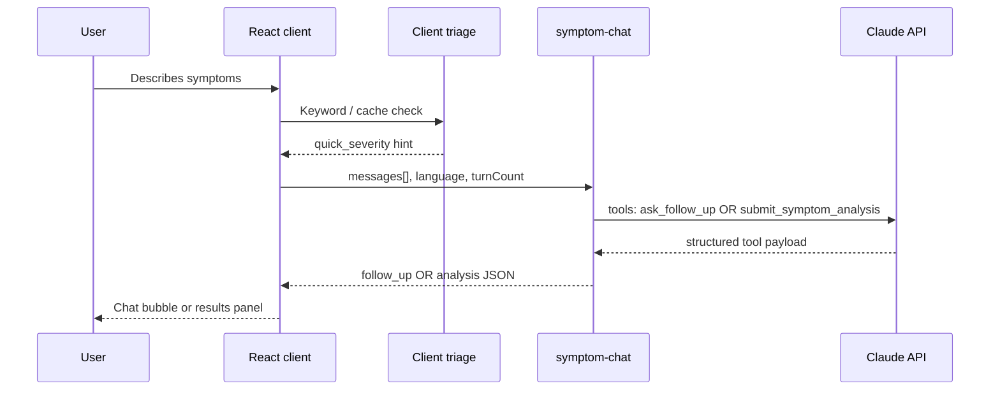

# AI systems

How HealthPilot uses large language models safely and reliably for symptom navigation in Pakistan.

## Overview

| Component | Role |
|-----------|------|
| `symptom-chat` | Primary multi-turn UX (tool calling) |
| `analyze-symptoms` | Single-shot analysis (evals, legacy) |
| `src/utils/symptomTriage.ts` | Client emergency keywords + pattern cache |
| `supabase/functions/_shared/*` | Schemas, safety, Claude client, RAG, traces |
| `eval/` | Regression dataset against edge functions |
| `medical_chunks` + RAG | Optional context from NHS / Pakistan corpus |

## Conversation flow



## Tool calling (why not raw JSON)

Claude is invoked with **forced tools**:

1. **`ask_follow_up`** — one clarifying question + `quick_severity`
2. **`submit_symptom_analysis`** — final structured analysis

Benefits:
- Avoids `JSON.parse` failures (especially with Urdu text in content)
- Schema enforced by tool definitions + server-side Zod (`_shared/schemas.ts`)
- Clear separation between “still chatting” and “done”

## Model resilience

Fallback chain in `_shared/models.ts`:

`claude-sonnet-4-6` → `claude-sonnet-4-5` → `claude-haiku-4-5`

On failure, the edge function retries with the next model before returning an error to the client.

## Safety layer

`_shared/safety.ts` + UI disclaimers:

- Severity clamping and red-flag surfacing
- Mandatory disclaimer fields in analysis output
- Not presented as diagnosis or prescription

See [safety.md](./safety.md).

## Observability

Each LLM call can log to **`ai_traces`**:

- `trace_id` (returned to client for feedback)
- Model name, token usage, latency
- Function name (`symptom-chat` / `analyze-symptoms`)

Users can submit thumbs up/down linked to `trace_id` in **`analysis_feedback`**.

## RAG (retrieval-augmented generation)

Optional path in `_shared/rag.ts`:

1. Embed user symptom text (Hugging Face `BAAI/bge-large-en-v1.5` or embedding API)
2. Vector search `medical_chunks` (pgvector)
3. Inject top chunks into Claude system context

**Ingest sources:**

- NHS Conditions (scraped, localized for Pakistan) — `pipeline/nhs/`
- Pakistan guidelines — `corpus/pakistan-guidelines/` + `scripts/seed-pakistan-corpus.ts`

## Evaluation harness

```bash
export VITE_SUPABASE_URL=...
export VITE_SUPABASE_ANON_KEY=...
npm run eval
npm run eval:report   # writes docs/eval-results.md
```

- Cases in `eval/cases.jsonl` (symptom text, expected specialty, severity bounds)
- Calls deployed edge functions (not mocked LLM)
- Useful for regression when changing prompts or models

## Key files

| File | Purpose |
|------|---------|
| `supabase/functions/symptom-chat/index.ts` | Main chat handler |
| `supabase/functions/_shared/claude.ts` | Anthropic client wrapper |
| `supabase/functions/_shared/schemas.ts` | Zod validation |
| `src/components/symptoms/SymptomChatInterface.tsx` | Chat UI |
| `src/utils/symptomTriage.ts` | Client-side triage |
| `eval/run-eval.ts` | Eval runner |

## API reference

Request/response shapes: [api-contracts.md](./api-contracts.md) (`symptom-chat`, `analyze-symptoms`).
