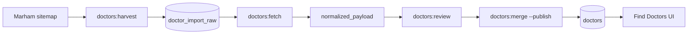

# Doctor directory

Verified-style doctor profiles for Pakistan, ingested from public marketplace pages (primary source: **Marham.pk**).

## Data flow



## What we store per doctor

| Field | Source |
|-------|--------|
| `full_name`, `specialty`, `qualification` | Profile HTML / og:title |
| `hospital_name`, `area`, `address`, `city_slug` | Practice block + city resolver |
| `consultation_fee` | Practice block fee (not sidebar promos) |
| `profile_details` | JSON: services, diseases, practice_timings, WhatsApp |
| `available_times` | `{ practice_timings: [{ day, start, end }] }` |
| `latitude`, `longitude` | Hospital/area lookup → city center fallback |
| `source`, `source_url` | Always `marham` + canonical URL |

## CLI commands

```bash
# 1. Collect profile URLs
npm run doctors:harvest -- --source marham --limit 2000

# 2. Download & parse HTML (rate-limited ~1 req/s)
npm run doctors:fetch -- --source marham --limit 100

# 3. Approve + publish to app
npm run doctors:merge -- --auto-approve --publish --limit 500

# Maintenance
npm run doctors:repair-marham -- --all --limit 500
npm run doctors:backfill-cities
npm run doctors:backfill-locations
npm run doctors:purge-seed          # remove demo seed doctors
```

## Parsing highlights (`pipeline/doctors/lib/html-extract.ts`)

- **Fee:** from Practice Address block only (ignores “Starting from Rs. 500” promos)
- **City:** Area line + URL slug (not page footer “Lahore” noise)
- **Timings:** HTML table rows under Available Timings
- **Boilerplate:** Marham template “professional statement” hidden in UI
- **Hospital:** `cleanWorkplaceName()` strips “Specialty at Hospital” titles

## Database tables

| Table | Purpose |
|-------|---------|
| `doctors` | Published directory (`publication_status = published`) |
| `doctor_import_raw` | Staging + `normalized_payload` |
| `doctor_source_records` | Multi-source linkage (future) |
| `doctor_claims` | Profile claim workflow |
| `pmdc_verification_queue` | PMDC verification queue |

## Search (PostGIS)

RPCs (see migrations `010`–`014`):

- `search_doctors_directory` — city, specialty (fuzzy), fee, gender, language
- `doctors_within_radius` — GPS + radius with specialty filter

App service: `src/services/doctorService.ts`

## Booking

- Public route: `/doctors/:id/book` (no login required)
- Slots generated from `practice_timings` for selected weekday
- Guest bookings via `create_guest_appointment` RPC (migration `013`)

## App surfaces

| Route | Component |
|-------|-----------|
| `/doctors` | `FindDoctorsDirectory` — filters, Near Me |
| `/doctors/:id` | `DoctorDetail` + `DoctorProfileExtras` |
| `/doctors/:id/book` | `BookAppointment` — day-aware slots |

## Tests

```bash
npm test   # includes pipeline/doctors/lib/*.test.ts
```

- `html-extract.test.ts` — fee, timings, boilerplate
- `doctorGender.test.ts`, `specialtyFilter.test.ts`, `pakistanCityExtract.test.ts`

## Related docs

- [pipeline/doctors/README.md](../pipeline/doctors/README.md)
- [plans/phase-b-doctor-data-acquisition.md](./plans/phase-b-doctor-data-acquisition.md)
