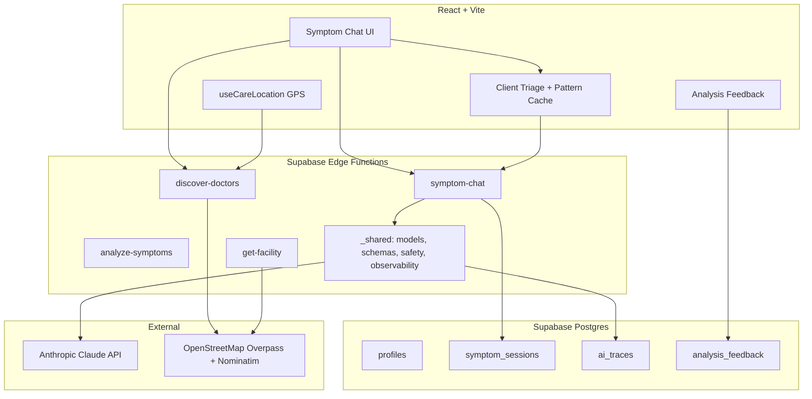

# HealthPilot AI — Architecture

## System overview

## Core user flows

### 1. Symptom checker (primary AI flow)

1. User opens `/symptom-checker` and describes symptoms (EN or UR).
2. **Client triage** (`symptomTriage.ts`) runs in &lt;1ms — emergency keywords, pattern cache.
3. **`symptom-chat`** edge function:
   - Follow-up turns: tool `ask_follow_up` (one question + `quick_severity`).
   - Final turn: tool `submit_symptom_analysis` (structured JSON).
4. **Validation** (`_shared/schemas.ts` + `safety.ts`) normalizes output; retries on schema failure.
5. **Observability** logs `trace_id`, model, tokens, latency to `ai_traces`.
6. Results panel shows specialty, severity, red flags, Urdu summary.
7. **`discover-doctors`** loads OSM facilities using **GPS coordinates first**, then city center.

### 2. Doctor / facility search

1. User opens `/doctors` with city filters or **Near Me** (GPS).
2. `liveCareDiscoveryService` calls `discover-doctors` with lat/lng + specialty.
3. Edge queries Overpass + Nominatim, dedupes, ranks by distance + specialty + contact.
4. List or map view; OSM places open at `/places/:id` (`get-facility` for deep links).

## Design decisions

| Decision | Rationale |
|----------|-----------|
| **Tool calling vs raw JSON** | Reliable structured fields; avoids `JSON.parse` failures (especially Urdu). |
| **Model fallback chain** | `claude-sonnet-4-6` → `sonnet-4-5` → `haiku-4-5` for resilience. |
| **OSM vs seeded doctor DB** | Live, nationwide coverage; no manual curation for discovery. |
| **GPS before profile city** | Profile city was often wrong (e.g. Karachi while user in Lahore). |
| **Client + server triage** | Fast emergency UX; server still validates severity in analysis. |
| **Edge functions as AI gateway** | Hides API keys; central logging, rate limits, RAG injection. |

## Edge functions

| Function | Role |
|----------|------|
| `symptom-chat` | Multi-turn symptom conversation + final analysis |
| `analyze-symptoms` | Single-shot analysis (evals + legacy path) |
| `discover-doctors` | Radius search on OSM healthcare amenities |
| `get-facility` | Single OSM place lookup by `osm_type` + `osm_id` |

See [api-contracts.md](./api-contracts.md).

## Data model (key tables)

- `profiles` — user city, area, language, demographics
- `symptom_sessions` — stored AI analysis JSON
- `ai_traces` — LLM request metadata (no raw PHI by default)
- `analysis_feedback` — thumbs up/down linked to `trace_id`
- `doctors` / `appointments` — legacy in-app booking for seeded doctors only

## Security

- Anthropic key only in Supabase secrets (never in frontend).
- Anon key in Vite env; RLS on user tables.
- Medical disclaimer on all AI outputs.
- Service role used only in edge functions for trace inserts.

## Planned extensions (CV roadmap)

- RAG over `corpus/pakistan-guidelines` + pgvector
- Offline eval harness (`eval/run-eval.ts`)
- CI + Vitest for triage/ranking utilities
- Optional vision triage (dermatology routing)

See [HealthPilot_AI_CV_Implementation_Plan.md](../../HealthPilot_AI_CV_Implementation_Plan.md).
