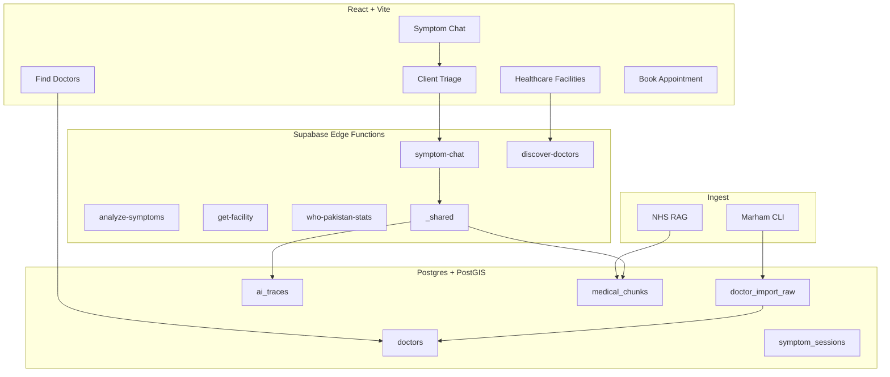

# Architecture

> **Start here:** [README](../README.md) (overview) · [AI_SYSTEMS.md](./AI_SYSTEMS.md) · [DOCTOR_DIRECTORY.md](./DOCTOR_DIRECTORY.md)

## System overview

## Core flows

### Symptom checker

1. User describes symptoms (EN / UR) on `/symptom-checker`.
2. Client triage (`symptomTriage.ts`) — emergency keywords, pattern cache.
3. `symptom-chat` edge function — tools: `ask_follow_up` or `submit_symptom_analysis`.
4. Results link to **directory doctors** + **OSM facilities** near GPS/city.

### Find doctors (Marham directory)

1. Published rows in `doctors` (`source = marham`, `publication_status = published`).
2. Search via `search_doctors_directory` or city listing + client filters.
3. Profile: fee, hospital, practice timings, services; book by weekday slots.

### Nearby facilities (OSM)

1. `discover-doctors` with `facilities_only` or default hybrid mode.
2. Overpass + Nominatim — live data, not the doctor table.

## Design decisions

| Decision | Rationale |
|----------|-----------|
| Tool calling vs raw JSON | Reliable structured analysis (especially Urdu) |
| Model fallback chain | Resilience when a Claude model is unavailable |
| Separate doctor DB vs OSM | Profiles vs live map amenities — different UX |
| GPS before profile city | Accurate Near Me and facility ranking |
| Staging import table | Safe Marham ingest with review before publish |
| Edge AI gateway | Secrets, traces, RAG in one place |

Full trade-off discussion: [ENGINEERING.md](./ENGINEERING.md).

## Edge functions

| Function | Role |
|----------|------|
| `symptom-chat` | Multi-turn symptom conversation |
| `analyze-symptoms` | Single-shot analysis (evals) |
| `discover-doctors` | OSM facility / hybrid discovery |
| `get-facility` | Single OSM place detail |
| `who-pakistan-stats` | WHO Pakistan health statistics cache |

API shapes: [api-contracts.md](./api-contracts.md).

## Data model (high level)

- `profiles`, `symptom_sessions`, `ai_traces`, `analysis_feedback`
- `doctors`, `doctor_import_raw`, `doctor_source_records`, `appointments`
- `medical_chunks`, `nhs_conditions` (RAG)
- `who_pakistan_stats_cache`

Migrations: `supabase/migrations/001`–`014`.

## Security

- Anthropic + service keys in Supabase secrets only
- RLS on user tables
- Medical disclaimers on AI surfaces
- Marham attribution via `source_url`

See [safety.md](./safety.md).
